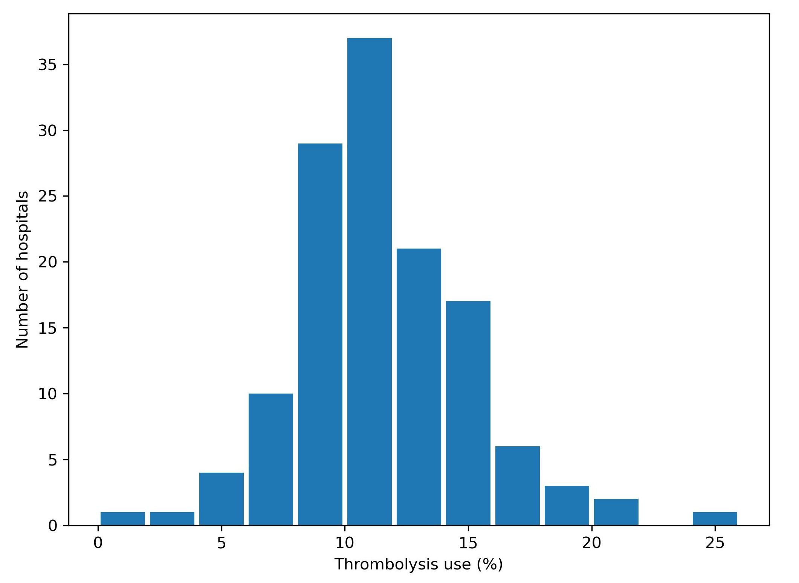
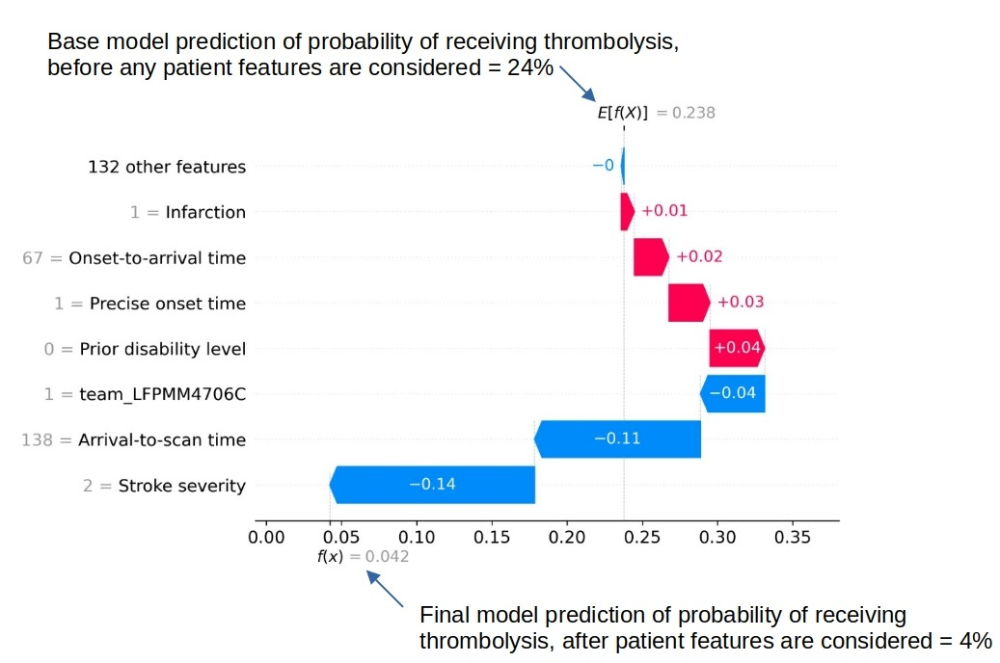
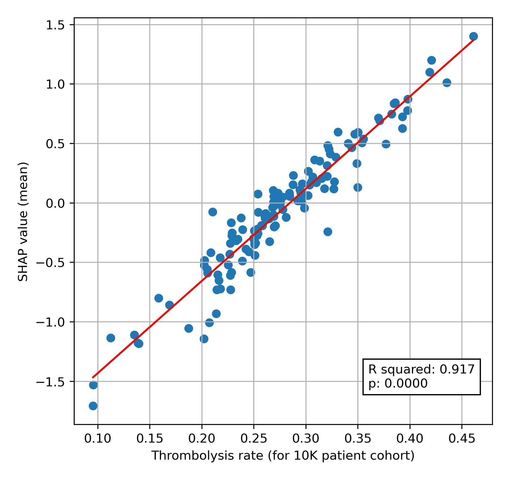
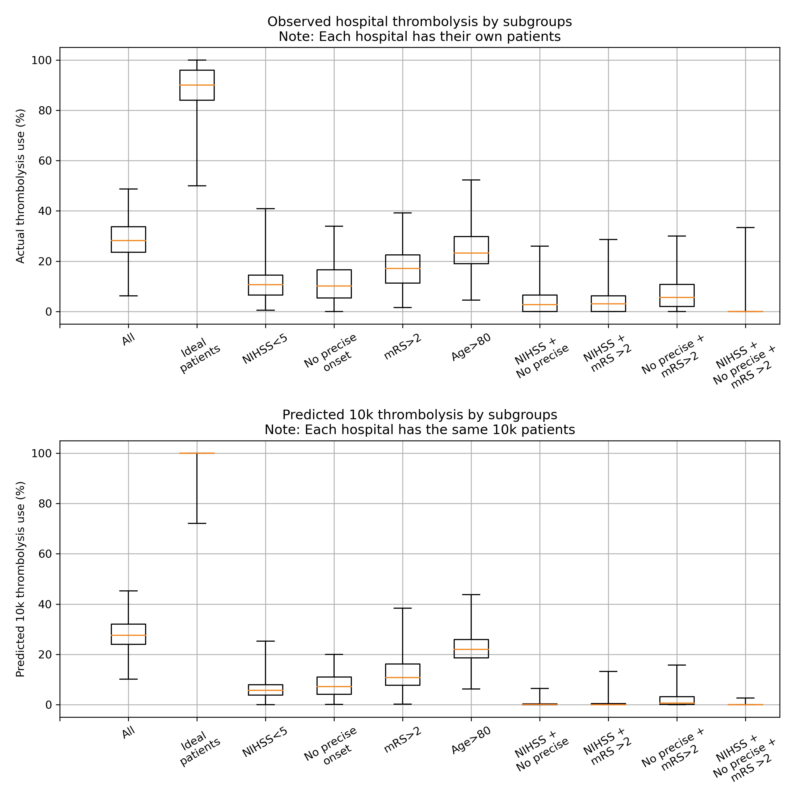
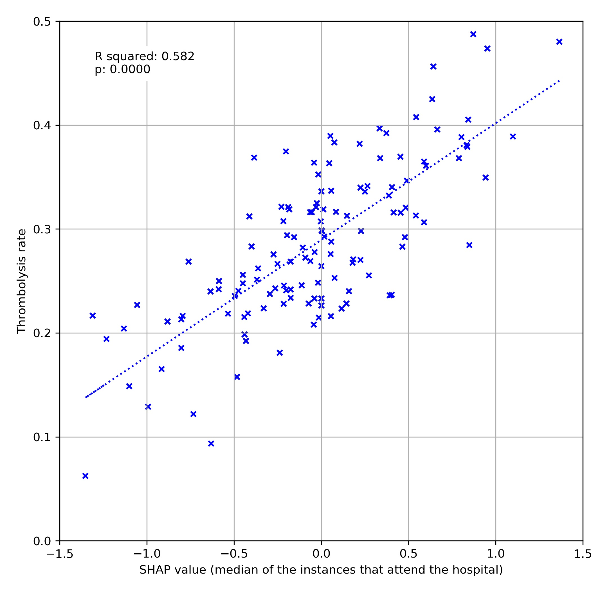

# SAMueL (Stroke Audit Machine Learning): What would other emergency stroke teams? Summary and key work

Part of the NIHR *SAMueL* (Stroke Audit Machine Learning) project, in collaboration with the Sentinel Stroke National Audit Program (SSNAP).

## A very short summary (credit: ChatGPT)....

This study used an explainable machine learning model to analyze data from 88,928 patients who arrived at emergency stroke units in England and Wales within 4 hours of known stroke onset. The study found that there is substantial variation in the use of thrombolysis, a treatment for stroke, between hospitals, with rates ranging from 7% to 49%. The study found that factors such as the amount of time between arrival at the hospital and being scanned, the severity of the stroke, the patient's pre-existing disability, and whether the stroke onset time was known precisely, influenced the odds of receiving thrombolysis. However, the study found that the majority of the variation in thrombolysis use between hospitals may be explained by differences in the hospitals' willingness to use the treatment, rather than the characteristics of the patients they treated.

## Background

Stroke is a common cause of adult disability. Most strokes (about four out of five) are caused by a blood clot in the brain, and have the potential to be treated with clot-busting drugs to break up the blood clot that is causing their stroke  - this is called *thrombolysis*. Thrombolysis improves stroke outcomes overall, with more people being able to carry out their normal daily activities. There is, however, a small risk of a bleed in the brain, which is fatal in about 1 in 50 patients receiving thrombolysis, with the risk being highest in those with the most severe strokes. Overall, thrombolysis does not increase risk of death, as the risk of death from a bleed is balanced out by the benefits of thrombolysis to others. Clinicians, patients, and carers, must however consider both benefits and risks of thrombolysis when deciding on whether to use it.

Expert opinion is that about one in five patients should receive thrombolysis, and this is the target set in the NHS long term plan. At the moment only about one in nine patients actually receive this treatment in the UK. There is a lot of variation between hospitals, which means that the same patient might receive different treatment depending on which hospital they attend. 

*Variation in thrombolysis use across hospitals in England and Wales 2016-2018.*

## Aims of this study

The aims of this study were 1) to apply *explainable machine learning* techniques to investigate the most significant features that drive decisions to use thrombolysis at different hospitals, and 2) to model and explain what are the the features that are most important in hospitals that we predict would make *different* decisions about any given patient.

## What is *Explainable Machine Learning*?

Machine learning models generally learn from large sets of data - learning patterns between aspects of the data and some outcome of interest. In this case the data contains a range of *features* about the patient, such as their age, sex, a breakdown of their stroke symptoms, etc. The machine learning model learns the relationship between those features and whether the patient receives thrombolysis or not. 

*A general depiction of machine learning models trained to predict use of thrombolysis for any patient given 1) the hospital they attend, 2) patient and clinical information, and 3) pathway and process information.*

There are many different types of machine learning (here we use one called *XG-Boost*), but all are making predictions based on similarities to what the model has seen before. Many machine learning models are what we call a *black box* model - that is we give it some information, and it makes a prediction, but we don't know *why* it made that particular prediction. 

*Explainable Machine Learning* seeks to be able to communicate *why* a model makes the prediction it does. We seek to understand, and communicate, the general patterns that the model is making (we call this *global explainability*), as well as why the model made the prediction it did for one particular patient (we call this *local explainability*). We also try to explain other important aspects about the model such as where the training data came from (and how representative is that data of where the model will be used in practice), and how sure we can be of the model's predictions - both generally and for any particular prediction.

In this project we are very much on a journey - discovering what different people would like to know about the model. Do patients, carers, clinicians, and other machine learning researchers all want to know the same things, or different things? How can we tailor *explainable machine learning* output to the wishes of different audiences?

(*Explainable machine learning* may also be known as *Explainable ML*, *Explainable artificial intelligence*, or *Explainable AI*).

## Methods

In this study we used a machine learning method called *XG-Boost* to predict decisions to give thrombolysis at each of 132 hospitals in England and Wales that deal with emergency stroke admissions. 

In order to make the model easier to explain, we found the most important features that would predict whether a patient received thrombolysis or not. We found that with just 10 features we could get accuracy that was very close to using *all* available features. These 10 features were:

* *Arrival-to-scan time*: Time from arrival at hospital to scan (mins)
* *Infarction*: Stroke type (1 = infarction, 0 = haemorrhage)
* *Stroke severity*: Stroke severity (NIHSS) on arrival
* *Precise onset time*: Onset time type (1 = precise, 0 = best estimate)
* *Prior disability level*: Disability level (modified Rankin Scale) before stroke
* *Stroke team*: Stroke team attended
* *Use of AF anticoagulents*: Use of atrial fibrillation anticoagulant (1 = Yes, 0 = No)
* *Onset-to-arrival time*: Time from onset of stroke to arrival at hospital (mins)
* *Onset during sleep*: Did stroke occur in sleep?
* *Age*: Age (as middle of 5 year age bands)

Note: The [GitHub repository](https://github.com/samuel-book/samuel_shap_paper_1) also includes XG-Boost models using all available features.

In order to explain model predictions we used a method called Shapley values, which are described below.

### What are Shapley values?

> Shapley values (or *SHAP*, SHapley Additive exPlanations, values, which is a particular method of estimating Shapley values) are *'the average expected marginal contribution of one player after all possible combinations have been considered'*.

Imagine a pub quiz team with up to 3 people. Any number of people may actually turn up on the night:

* There are 8 possible combinations of players (including no-one turning up).

* The Shapley value for any team member describes the average difference in score when a particular player is present or absent compared to the average of all combinations of players.

The same principle may be applied in machine learning: How does any one feature (e.g. stroke severity, or age), on average, contribute to the prediction after considering all possible combinations of features? What difference does that feature make to the prediction?

## Key findings

### Predicting thrombolysis use with an XG-Boost model

Looking at patterns oh SHAP values reveals the following:

* Stroke type: As expected,  the SHAP values for stroke types effectively eliminates any chance of receiving thrombolysis for haemorrhagic stroke.

* Arrival-to-scan time: The odds of receiving thrombolysis reduces by about 20 fold over the first 100 minutes of arrival to scan time.

* Stroke severity (NIHSS): The odds of receiving thrombolysis is lowest at NIHSS 0, rises and peaks at NIHSS 15-25, and then falls again with higher stroke severity. The difference between minimum odds (at NIHSS 0) and maximum odds (at 15-25) of receiving thrombolysis is 30-35 fold.

* Stroke onset time type (precise vs. estimated): The odds of receiving thrombolysis are about 3 fold greater for precise onset time than estimated onset time.

* Disability level (Rankin) before stroke. The odds of receiving thrombolysis falls about 5 fold between mRS 0 and 5.

* The hospital SHAP values ranges from -1.4 to +1.4. This range of SHAP (log odds) represents a 15 fold difference in odds of receiving thrombolysis (most are in the range of -1 to +1, but this still represents a 7-8 fold difference in odds of receiving thrombolysis). 

The figure below shows a violin plot of SHAP values for six features.

*A violin plot showing the individual SHAP values for six features. The shape of the violin shows the spread of the size of SHAP values for each feature value. A positive SHAP vales pushes the model towards saying that patient would would receive thrombolysis. A negative SHAP value pushes the model towards saying that patient would would not receive thrombolysis.*

SHAP plots can also be used to explain predictions of any individual patient. 

*An example of a SHAP waterfall plot showing the most influential features in influencing the model’s prediction of a patient probability of receiving thrombolysis (in this case a patient with a very low probability of receiving thrombolysis). In this example the three most influential features, reducing the chance of receiving thrombolysis were 1) low stroke severity (NIHSS 2), 2) slow arrival-to-scan time (138 mins), and 3 the hospital attended (stroke team LFPMM4706C).*

### Comparing hospital SHAP values with the predicted thrombolysis rate at each hospital if all hospitals saw the same 10k cohort of patients

We can assess each hospital's *'propensity to use thrombolysis'* by passing the same 10k cohort of patients through all hospital prediction models (by keeping all patient features the same apart from changing the hospital ID). In this analysis we train the XGBoost model on all patients apart from those in the 10k patient cohort (which are selected randomly from the full data set), and then assess thrombolysis use in the 10k data set.

When we compare this 10k thrombolysis rate to the average hospital SHAP model in our previously trained XGBoost model, we find a very strong correlation (R-squared = 0.917). This helps to validate average hospital SHAP being used as a measure of a hospital's *'propensity to use thrombolysis'*.

*A comparison of average hospital SHAP values with predicted hospital thrombolysis use if all hospitals saw the same 10k patient cohort.*

We see that hospital SHAP values range from about -1.5 to +1.5. This range of 3 (in log odds) between hospitals represents a range of about 20 fold in the odds of a patient receiving thrombolysis, simply by virtue of which hospital they attend. Most hospitals lie within the range of -1.0 to +1.0, but this still represents a 7-8 fold range in the ods of receiving thrombolysis.

### Comparing actual and predicted thrombolysis use in subgroups of patients

We can select subgroups from the 10k patient cohort and the observed data (where we create subgroups of patients who attend each hospital and observed whether they were actually given thrombolysis or not). The subgroups selected were:

* Mild stroke severity (NIHSS < 5)
* No precise onset time
* Existing pre-stroke disability (mRS > 2)
* An 'ideal' thrombolysable patient: NIHSS 10-25, Arrival-to-scan time < 30 minutes, Stroke type = infarction, Precise onset time = True, Prior disability level (mRS) = 0, No use of AF anticoagulants, Onset-to-arrival time < 90 minutes, Age < 80 years, Onset during sleep = False

Note: When we use the predicted thrombolysis in the 10k cohort subgroups we are using the same patients at all hospitals. When we examine the observed ('real') data we must necessarily look at different patients in each hospital.

The observed and predicted subgroup analysis show very similar general patterns (r-squared=0.95). The three subgroups of NIHSS <5, no precise stroke onset time, and pre-stroke mRS > 2, all had reduced thrombolysis use, and combining these non-ideal features reduced thrombolysis use further.

The three subgroups of NIHSS <5, no precise stroke onset time, and prestroke mRS > 2, tended to reduce in parallel, along with total thrombolysis use, suggesting a shared caution in use of thrombolysis in ‘less ideal’ patients.

Some differences exist:

The use of thrombolysi in ideal patients is a little low in the observed vs actual results (mean hopsital thrombolysis use = 89% vs 99%).

The predicted results show a stronger effect of combining non-ideal features.

When testing the 'ideal' thrombolysable patients, 95% of hospitals would be expected to give thrombolysis to at least 99% of patients.

*A comparison of between-hospital range of thrombolysis use for subgroups of observed (top) or the 10k patient cohort (bottom). The observed patients are the actual thrombolysis use at each hospital for subgroups of their own patients. The predicted 10k patient subgroups are the same patients for every hopsital.*

### How much of the variation in thrombolysis use (for patients arriving within 4 hours of known stroke onset) can be explained by the hospital SHAP value? 

We can also look at how a hospital's SHAP value correlates with the thrombolysis rate for patients attending each hospital (focussing on patients arriving within 4 hours of stroke onset). We see that the hospital's SHAP value explains 58% of the variance in thrombolysis rate of patients. This suggests that, differences in decisions on whether and when to use thrombolysis dominates differences in patient mix or difference in key process times (time to arrival, and time from arrival to scan).

*A comparison of average hospital SHAP values with actual hospital thrombolysis use for patients arriving within 4 hours of known stroke onset.*

### Using artificial patients

We may construct artificial patients to compare decision-making with a particular focus. 

For example we may start with a highly thrombolysable patient:

* Infarction = Yes
* Stroke severity (NIHSS) = 15
* Precise onset time = Yes
* Disability (mRS) before stroke = 0
* Age = 72
* Onset-to-arrival = 60 minutes
* Arrival-to-scan = 15 minutes
* Use of anticoagulants for AF = No
* Onset during sleep = No

For such a patient we find 131/132 would be expected to give them thrombolysis. 

If we change only stroke severity (NIHSS) to 5, we find 95% of stroke teams would be expected to give them thrombolysis.

If we change only precise onset time to 'No', we find 87% of stroke teams would be expected to give them thrombolysis.

If we change both stroke severity (NIHSS) to 5, and precise onset time to 'No', we find 35% of stroke teams would be expected to give them thrombolysis.

