# Appendix

For machine learning, our aim was to predict which patients would receive thrombolysis at each hospital. We limit machine learning to patients arriving within 4 hours of known stroke onset (36% of all stroke admissions) as these are the patients who arrive in hospital with time left to administer thrombolysis.

Following features selection of the most influential features, 10 features were used for predictions:

* *Arrival-to-scan time*: Time from arrival at hospital to scan (mins)
* *Infarction*: Stroke type (1 = infarction, 0 = haemorrhage)
* *Stroke severity*: Stroke severity (NIHSS) on arrival
* *Precise onset time*: Onset time type (1 = precise, 0 = best estimate)
* *Prior disability level*: Disability level (modified Rankin Scale) before stroke
* *Stroke team*: Stroke team attended
* *Use of AF anticoagulants*: Use of atrial fibrillation anticoagulant (1 = Yes, 0 = No)
* *Onset-to-arrival time*: Time from onset of stroke to arrival at hospital (mins)
* *Onset during sleep*: Did stroke occur in sleep?
* *Age*: Age (as middle of 5 year age bands)

## Data

### Data access

Data was obtained from the Sentinel Stroke National Audit (SSNAP [1]), managed through the Healthcare Quality Improvement Partnership (HQIP [2]). SSNAP has near-complete coverage of all acute stroke admissions in the UK (outside Scotland). All hospitals admitting acute stroke participate in the audit, and year-on-year comparison with Hospital Episode Statistics [3] confirms estimated case ascertainment of 95% of coded cases of acute stroke.

The NHS Health Research Authority decision tool [4] was used to confirm that ethical approval was not required to access the data. Data access was authorised by HQIP (reference HQIP303). 

Data was retrieved for 246,676 emergency stroke admissions to acute stroke teams in England and Wales between 2016 and 2018 (three full years). 88,928 patients arrived within 4 hours of known stroke onset.

[1] https://www.strokeaudit.org/

[2] https://www.hqip.org.uk/

[3] https://digital.nhs.uk/data-and-information/data-tools-and-services/data-services/hospital-episode-statistics

[4] http://www.hra-decisiontools.org.uk/research/

### Data Fields

#### Stroke Team
* StrokeTeam: Pseudonymised SSNAP ‘routinely admitting team‘ unique identifier. For emergency care it is expected that each hospital has one stroke team (though post-72 hour care may be reported under a different team at that hospital).

#### Patient – general
* Pathway: Total number of team transfers, excluding community teams
* S1AgeOnArrival: Age on arrival aggregated to 5 year bands
* MoreEqual80y: Whether the patient is >= 80 years old at the moment of the stroke
* S1Gender: Gender
* S1Ethnicity: Patient Ethnicity. Aggregated to White, Black, Mixed, Asian and Other

#### Patient – pathway information
* S1OnsetInHospital: Whether the patient was already an inpatient at the time of stroke
* S1OnsetToArrival_min: Time from symptom onset to arrival at hospital in minutes, where known and if out of hospital stroke
* S1OnsetDateType: Whether the date of onset given is precise, best estimate or if the stroke occurred while sleep
* S1OnsetTimeType: Whether the time of symptom onset given is precise, best estimate, not known
* S1ArriveByAmbulance: Whether the patient arrived by ambulance
* S1AdmissionHour: Hour of arrival, aggregates to 3 hour epochs
* S1AdmissionDay: Day of week at the moment of admission
* S1AdmissionQuarter: Year quarter (Q1: Jan-Mar; Q2:April-Jun; Q3: Jul-Sept; Q4: Oct-Dec)
* S1AdmissionYear: Year of admission
* S2BrainImagingTime_min: Time from Clock Start to brain scan. In minutes. “Clock Start” is used throughout SSNAP reporting to refer to the date and time of arrival at first hospital for newly arrived patients, or to the date and time of symptom onset if patient already in hospital at the time of their stroke.
* S2ThrombolysisTime_min: Time from Clock Start to thrombolysis. In minutes. “Clock Start” is used throughout SSNAP reporting to refer to the date and time of arrival at first hospital for newly arrived patients, or to the date and time of symptom onset if patient already in hospital at the time of their stroke.

#### Patient – comorbidities
* CongestiveHeartFailure: Pre-Stroke Congestive Heart Failure
* Hypertension: Pre-Stroke Systemic Hypertension
* AtrialFibrillation: Pre-Stroke Atrial Fibrillation (persistent, permanent, or paroxysmal)
* Diabetes: Comorbidities: Pre-Stroke Diabetes Mellitus
* StrokeTIA: Pre-Stroke history of stroke or Transient Ischaemic Attack (TIA)
* AFAntiplatelet: Only available if “Yes” to Atrial Fibrillation comorbidity. Whether the patient was on antiplatelet medication prior to admission
* AFAnticoagulent: Prior to 01-Dec-2017: Only available if “Yes” to Atrial Fibrillation comorbidity; From 01-Dec-2017: available even if patient is not in Atrial Fibrillation prior to admission. Whether the patient was on anticoagulant medication prior to admission
* AFAnticoagulentVitK: If the patient was receiving anticoagulant medication, was it vitamin K antagonists
* AFAnticoagulentDOAC: If the patient was receiving anticoagulant medication, was it direct oral anticoagulants (DOACs)
* AFAnticoagulentHeparin: If the patient was receiving anticoagulant medication, was it Heparin

#### Patient – NIH Stroke Scale
* S2NihssArrival: National Institutes of Health Stroke Scale score on arrival at hospital
* BestGaze: National Institutes of Health Stroke Scale Item 2 Best Gaze (higher values indicate more severe deficit)
* BestLanguage: National Institutes of Health Stroke Scale Item 9 Best Language (higher values indicate more severe deficit)
* Dysarthria: National Institutes of Health Stroke Scale Item 10 Dysarthria (higher values indicate more severe deficit)
* ExtinctionInattention: National Institutes of Health Stroke Scale Item 11 Extinction and Inattention (higher values indicate more severe deficit)
* FacialPalsy: National Institutes of Health Stroke Scale Item 4 Facial Paresis (higher values indicate more severe deficit)
* LimbAtaxia: National Institutes of Health Stroke Scale Item 7 Limb Ataxia (higher values indicate more severe deficit)
* Loc: National Institutes of Health Stroke Scale Item 1a Level of Consciousness (higher values indicate more severe deficit)
* LocCommands: National Institutes of Health Stroke Scale Item 1c Level of Consciousness Commands (higher values indicate more severe deficit)
* LocQuestions: National Institutes of Health Stroke Scale Item 1b Level of Consciousness Questions (higher values indicate more severe deficit)
* MotorArmLeft: National Institutes of Health Stroke Scale Item 5a Motor Arm - Left (higher values indicate more severe deficit)
* MotorArmRight: National Institutes of Health Stroke Scale Item 5b Motor Arm - Right (higher values indicate more severe deficit)
* MotorLegLeft: National Institutes of Health Stroke Scale Item 6a Motor Leg - Left (higher values indicate more severe deficit)
* MotorLegRight: National Institutes of Health Stroke Scale Item 6b Motor Leg - Right (higher values indicate more severe deficit)
* Sensory: National Institutes of Health Stroke Scale Item 8 Sensory (higher values indicate more severe deficit)
* Visual: National Institutes of Health Stroke Scale Item 3 Visual Fields (higher values indicate more severe deficit)

#### Patient – other clinical features
* S2INR: Patient’s International Normalised ratio (INR) on arrival at hospital (available since 01-Dec-2017)
* S2INRHigh: INR was greater than 10 on arrival at hospital (available since 01-Dec-2017)
* S2INRNK: INR not checked (available since 01-Dec-2017)
* S2NewAFDiagnosis: Whether a new diagnosis of Atrial Fibrillation was made on admission
* S2RankinBeforeStroke: Patient’s modified Rankin Scale score before this stroke (Higher values indicate more disability)
* S2StrokeType: Whether the stroke type was infarction or primary intracerebral haemorrhage
* S2TIAInLastMonth: Whether the patient had a Transient Ischaemic Attack during the last month. Item from the SSNAP comprehensive dataset questions (not mandatory)

#### Patient – thrombolysis given
* S2Thrombolysis: Whether the patient was given thrombolysis (clot busting medication)

#### Patient – reason stated for not giving thrombolysis
* Age: If the answer to thrombolysis given was “no but”, the reason was Age
* Comorbidity: If the answer to thrombolysis given was “no but”, the reason was Co-morbidity
* Haemorrhagic: If the answer to thrombolysis given was “no but”, the reason was Haemorrhagic stroke
* Improving: If the answer to thrombolysis given was “no but”, the reason was Symptoms Improving
* Medication: If the answer to thrombolysis given was “no but”, the reason was Medication
* OtherMedical: If the answer to thrombolysis given was “no but”, the reason was Other medical reason
* Refusal: If the answer to thrombolysis given was “no but”, the reason was Refusal
* TimeUnknownWakeUp: If the answer to thrombolysis given was “no but”, the reason was Symptom onset time unknown/wake-up stroke
* TimeWindow: If the answer to thrombolysis given was “no but”, the reason was Age
* TooMildSevere: If the answer to thrombolysis given was “no but”, the reason was Stroke too mild or too severe

## Variation in thrombolysis use

Thrombolysis use in the original data varied between hospitals, from 1.5% to 24.3% of all patients, and 7.3% to 49.7% of patients arriving within 4 hours of known stroke onset.

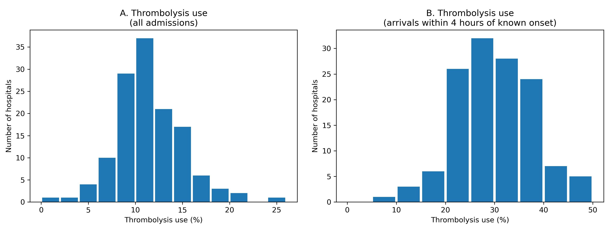

*Histogram of observed thrombolysis use in 132 hospitals. Left: Thrombolysis shown as a percentage of all emergency stroke admissions. Right: Thrombolysis shown as a percentage of those patients who arrive at hospitals within 4 hours of known stroke onset.*

## Machine learning

All work was conducted in Python (v3.8). All code is available at: https://github.com/samuel-book/samuel_shap_paper_1

Our machine learning model used XGBoost (*eXtreme Gradient Boosting*, v1.5, Chen & Guestrin, 2016). We used default settings apart from *learning rate* was set at 0.5 (see section below on *'Fine-tuning of model regularisation'*.

Machine learning models were explained using SHAP (*SHapley Additive exPlanations*, v0.41, Lundberg & Lee, 2017). 

Chen, T. & Guestrin, C., 2016. XGBoost: A Scalable Tree Boosting System. In Proceedings of the 22nd ACM SIGKDD International Conference on Knowledge Discovery and Data Mining. KDD &#x27;16. New York, NY, USA: ACM, pp. 785–794. Available at: http://doi.acm.org/10.1145/2939672.2939785.

Lundberg SM, Lee SI. A Unified Approach to Interpreting Model Predictions. In: Advances in Neural Information Processing Systems [Internet]. Curran Associates, Inc.; 2017 [cited 2022 Jun 17]. Available from: https://proceedings.neurips.cc/paper/2017/hash/8a20a8621978632d76c43dfd28b67767-Abstract.html

## Feature selection

25 features were selected by identifying one feature at a time that led to greatest improvement in Receiver Operating Characteristic (ROC) Area Under Curve (AUC). ROC AUC was measured using stratified 5-fold cross validation.

The best model with 1, 2, 5, 10, 25 & all features (60 features before one-hot encoding of fields) had ROC AUCs of 0.715, 0.792, 0.891, 0.919, 0.923 & 0.922. We selected 10 features for all subsequent work, which were:

* *Arrival-to-scan time*: Time from arrival at hospital to scan (mins)
* *Infarction*: Stroke type (1 = infarction, 0 = haemorrhage)
* *Stroke severity*: Stroke severity (NIHSS) on arrival
* *Precise onset time*: Onset time type (1 = precise, 0 = best estimate)
* *Prior disability level*: Disability level (modified Rankin Scale) before stroke
* *Stroke team*: Stroke team attended
* *Use of AF anticoagulants*: Use of atrial fibrillation anticoagulant (1 = Yes, 0 = No)
* *Onset-to-arrival time*: Time from onset of stroke to arrival at hospital (mins)
* *Onset during sleep*: Did stroke occur in sleep?
* *Age*: Age (as middle of 5 year age bands)

The improvement in ROC AUC with increasing features is shown in the figure below.

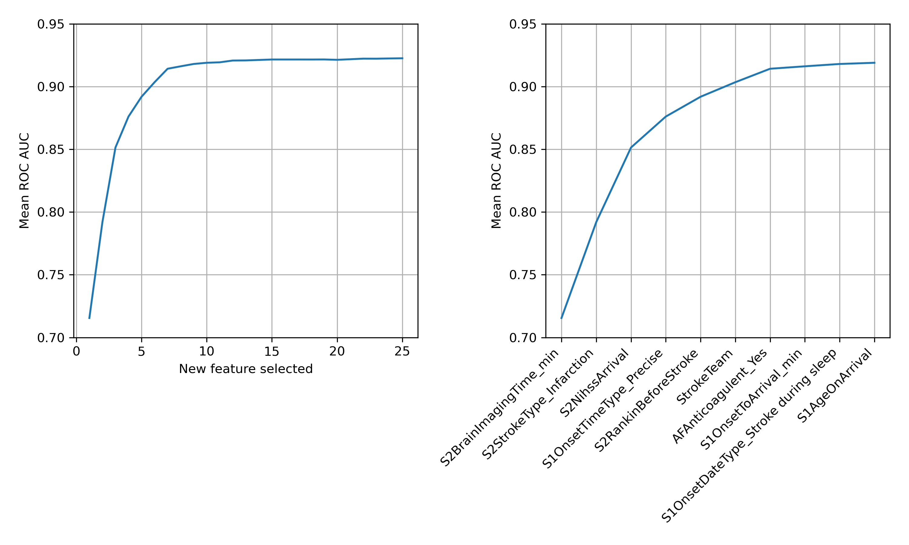

*The effect of increasing the number of features on model accuracy measured by Receiver Operating Characteristic (ROC) Area Under Curve (AUC). Left: Improvement with ROC AUC with selection of up to 25 features. Right: Improvement with ROC AUC with selection of the best 10 features. ROC was measured with stratified 5-fold cross-validation. Results show the mean of the 5-fold replicates.*

### Correlations within the 10 selected features

Correlations between the 10 features were measured using coefficients of determination (r-squared). All r-squared were less than 0.15, and all r-squared were less than 0.05 except 1) age and prior disability level (r-squared 0.146), and 2) onset during sleep and precise onset time (r-squared 0.078).

|               variable 1 |               Variable 2 | r-squared |
|-------------------------:|-------------------------:|----------:|
|                      Age |   Prior disability level |    0.1462 |
|       Onset during sleep |       Precise onset time |    0.0784 |
|          Stroke severity |   Prior disability level |    0.0454 |
|          Stroke severity |               Infarction |    0.0386 |
|       Precise onset time |    Onset-to-arrival time |    0.0344 |
|          Stroke severity |                      Age |    0.0268 |
|                      Age | Use of AF anticoagulants |    0.0207 |
|          Stroke severity |    Onset-to-arrival time |    0.0186 |
|       Precise onset time |   Prior disability level |    0.0131 |
|                      Age |       Precise onset time |    0.0090 |
|   Prior disability level | Use of AF anticoagulants |    0.0070 |
|       Onset during sleep |    Onset-to-arrival time |    0.0043 |
|    Onset-to-arrival time |                      Age |    0.0038 |
| Use of AF anticoagulants |               Infarction |    0.0033 |
|   Prior disability level |    Onset-to-arrival time |    0.0022 |
|       Precise onset time |     Arrival-to-scan time |    0.0021 |
| Use of AF anticoagulants |          Stroke severity |    0.0019 |
|     Arrival-to-scan time |          Stroke severity |    0.0019 |
|       Precise onset time | Use of AF anticoagulants |    0.0016 |
|          Stroke severity |       Onset during sleep |    0.0011 |
|               Infarction |    Onset-to-arrival time |    0.0007 |
|               Infarction |       Onset during sleep |    0.0007 |
|               Infarction |       Precise onset time |    0.0006 |
|    Onset-to-arrival time |     Arrival-to-scan time |    0.0004 |
|     Arrival-to-scan time |   Prior disability level |    0.0001 |
|    Onset-to-arrival time | Use of AF anticoagulants |    0.0001 |
|          Stroke severity |       Precise onset time |    0.0000 |
|     Arrival-to-scan time |                      Age |    0.0000 |
| Use of AF anticoagulants |       Onset during sleep |    0.0000 |
|   Prior disability level |       Onset during sleep |    0.0000 |
|               Infarction |                      Age |    0.0000 |
| Use of AF anticoagulants |     Arrival-to-scan time |    0.0000 |
|       Onset during sleep |     Arrival-to-scan time |    0.0000 |
|     Arrival-to-scan time |               Infarction |    0.0000 |
|                      Age |       Onset during sleep |    0.0000 |
|   Prior disability level |               Infarction |    0.0000 |

## Model accuracy

Model accuracy was measured using stratified 5-fold cross validation. The key results are shown below.

| Accuracy measurement             | mean  | std   |
|----------------------------------|-------|-------|
| Actual positive rate             | 0.296 | 0.000 |
| Actual negative rate             | 0.704 | 0.000 |
| Predicted positive rate          | 0.294 | 0.002 |
| Predicted negative rate          | 0.706 | 0.002 |
| Accuracy                         | 0.850 | 0.004 |
| Sensitivity (recall)             | 0.743 | 0.004 |
| Specificity                      | 0.894 | 0.004 |
| Precision                        | 0.747 | 0.007 |
| ROC AUC                          | 0.918 | 0.003 |
| Balanced sensitivity/specificity | 0.839 | 0.003 |

We found an overall accuracy of 85%, with a balanced accuracy. The predicted thrombolysis rate of 29.4% was very close to the observed thrombolysis rate of 29.6%.

The figure below shows the receiver operating characteristic curve, along with the trade-off between sensitivity and specificity.

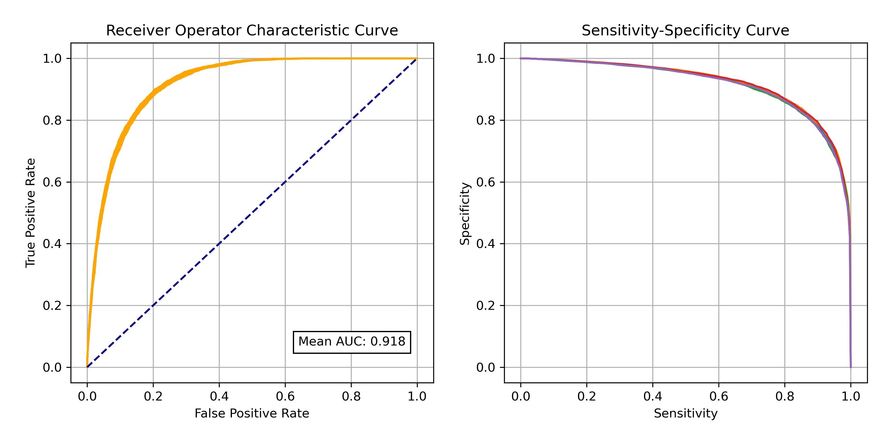

*Model accuracy of a XGBoost model using 10 features. Left: Receiver Operating Characteristic (ROC) Area Under Curve (AUC). Right: The trade-off between Sensitivity and Specificity. Accuracy was measured with stratified 5-fold cross-validation, and both charts show all 5 k-fold replicates.*

### Validation of hospital thrombolysis use

With k-fold validation, every instance is in one, but only one, test set. The test sets may therefore be combined to have predictions for the whole data set. Using these collated results we compared predicted thrombolysis use at each hospital with the actual (observed) thrombolysis use. There was very good agreement between predicted and observed thrombolysis use at each hospital (r-squared 0.977).

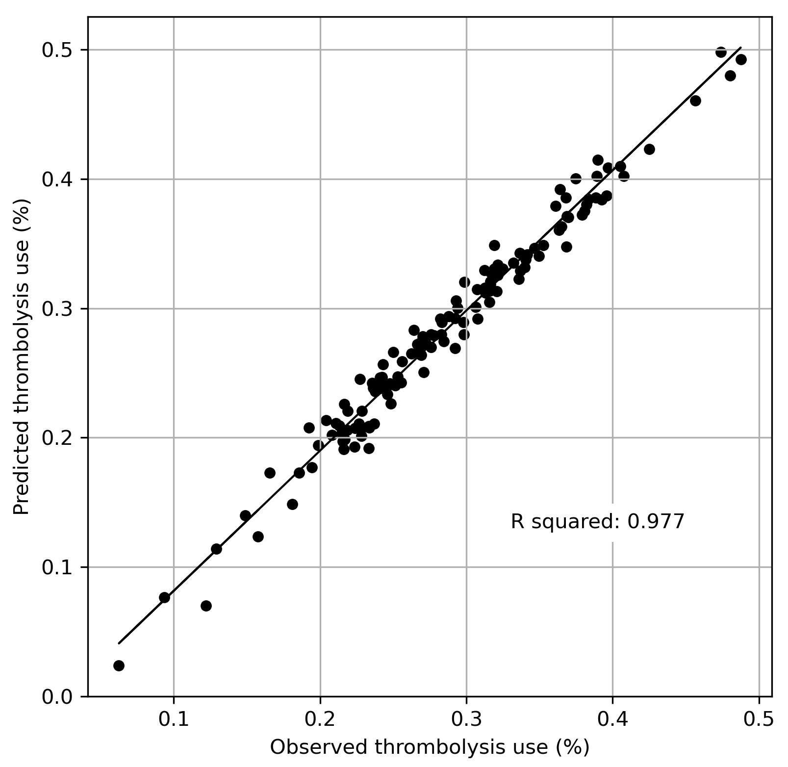

*Comparison of predicted and observed thrombolysis use for 132 hospitals.*

### Model calibration

The model calibration was checked by binning predictions by probability, and comparing the mean predicted probability with the fraction that were actually positive. In a well-calibrated model, in each bin the average probability of receiving thrombolysis should be close to the proportion of patients who actually received thrombolysis. Results demonstrated that the model was naturally well-calibrated, and was not in need of any calibration correction. As expected, the fraction of predictions that were correct is related to the predicted probability of receiving thrombolysis (when predictions were close to 50% probability of receiving thrombolysis the model was correct about 50% of the time, whereas when the model had predictions of <10% or >90% probability of receiving thrombolysis, the model was be correct about 90% of the time).

Nearly 50% of patients fell in the 0-10% probability of receiving thrombolysis - that is the model gave a confident prediction that the these patients would not receive thrombolysis, with the model being correct in these predictions 98% of the time.

| bin       | predicted probability | fraction positive | fraction correct | frequency |
|-----------|-----------------------|-------------------|------------------|-----------|
| 0.0 - 0.1 | 0.018                 | 0.023             | 0.977            | 0.480     |
| 0.1 - 0.2 | 0.146                 | 0.174             | 0.826            | 0.082     |
| 0.2 - 0.3 | 0.248                 | 0.271             | 0.729            | 0.056     |
| 0.3 - 0.4 | 0.348                 | 0.371             | 0.629            | 0.045     |
| 0.4 - 0.5 | 0.450                 | 0.443             | 0.557            | 0.043     |
| 0.5 - 0.6 | 0.551                 | 0.546             | 0.546            | 0.042     |
| 0.6 - 0.7 | 0.652                 | 0.643             | 0.643            | 0.049     |
| 0.7 - 0.8 | 0.753                 | 0.736             | 0.736            | 0.065     |
| 0.8 - 0.9 | 0.852                 | 0.827             | 0.827            | 0.089     |
| 0.9 - 1.0 | 0.932                 | 0.893             | 0.893            | 0.049     |

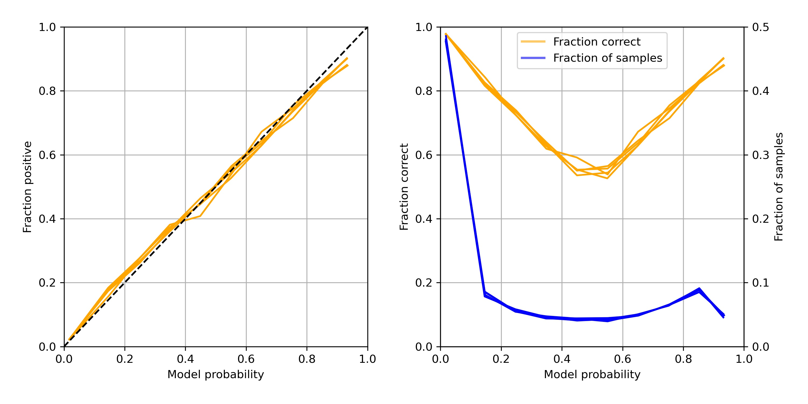

*Calibration check of the model. Left: The proportion of patients receiving thrombolysis for binned probability of receiving thrombolysis. Right: The proportion of predictions in each bin (blue), and the proportion of predictions that are correct (orange). Plot show results for all 5 k-fold replicates.*

### Evaluating variation in model predictions and predicted 10k cohort thrombolysis rate using bootstrap models

Data was split into a training set of 78,928 patients, and a test set of 10k patients. 30 models were trained, each with a different bootstrap sample of the training set and with a different model random seed. For each of the 10k test set, we evaluated the variation in the predicted probability of receiving thrombolysis. The mean of these standard deviations was 0.057, but the variation depended on the probability, with variation peaking at about 0.13 when the prediction probability of receiving thrombolysis was around 0.5.

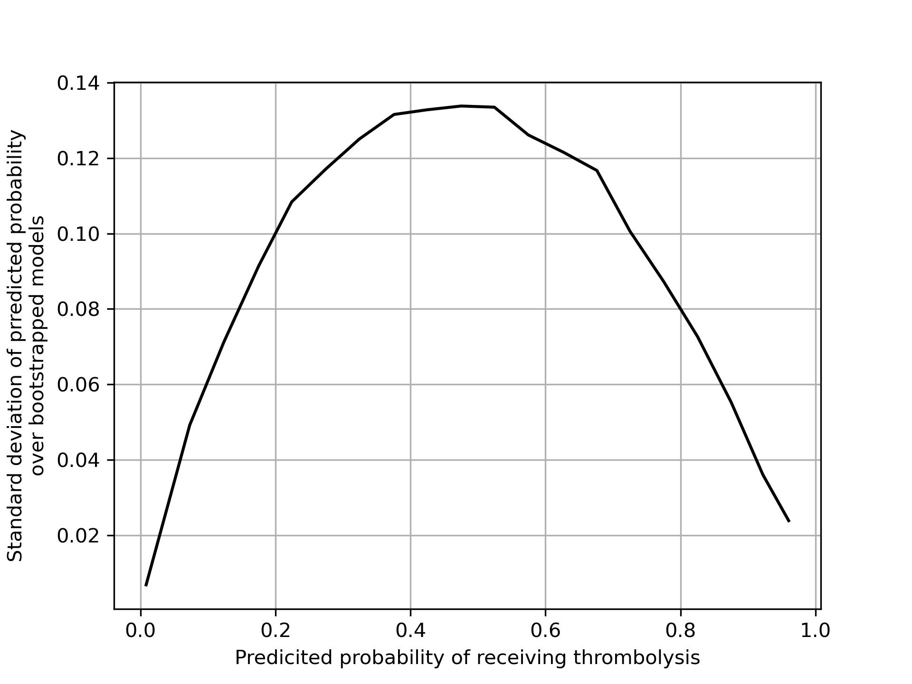

*Standard deviation of predicted probability of receiving thrombolysis, from 30 bootstrapped models predicting the probability of receiving thrombolysis in 10k patients. Results are binned by predicted probability.*

Additionally, we used the models and test set to predict thrombolysis use at each of the 132 hospitals if the 10k cohort of patients had attended each of the hospitals (by changing the hospital one-hot encoding). We predicted the thrombolysis use at each hospital, and examined the variation between the 30 bootstrapped models. The mean of the standard deviation of bootstrap replicates was 1.7% (where hospital thrombolysis use rates were 10% to 45%).

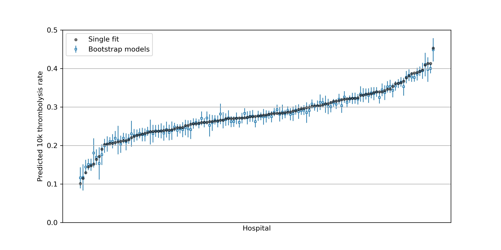

*Mean and standard deviation of predicted thrombolysis use at 132 hospitals from 30 bootstrapped models. Results are for predicted thrombolysis use for the same 10k patient cohort for each hopsital. In addition to the results for the bagging models, the predicted thrombolysis use for a single model with bootstrap sampling is shown. Results are ordered by thrombolysis use at each hospital predicted from the single non-bootstrap model.*

Bagging experiments were repeated with *Baysian Bootstrapping* based on weighting training samples using a Dirichlet distribution. Very similar results were achieved, with a mean standard deviation of bootstrap replicate probability predictions of 0.054, and a mean standard deviation of bootstrap replicate 10k thrombolysis use in hospitals of 1.6%.

The evaluation of bootstrapped replicates gave us confidence that a single model fit would be sufficient. 

### Learning curves

Learning curves evaluate the relationship between training set size and model accuracy. Learning curves were performed using stratified 5-fold validation, and by random sampling (without replacement) of the training set. The maximum accuracy achieved was 85% using 70k training instances, 82.5% accuracy was achieved with 4k training instances. There was a shallow improvement between 4k and 70k training points.

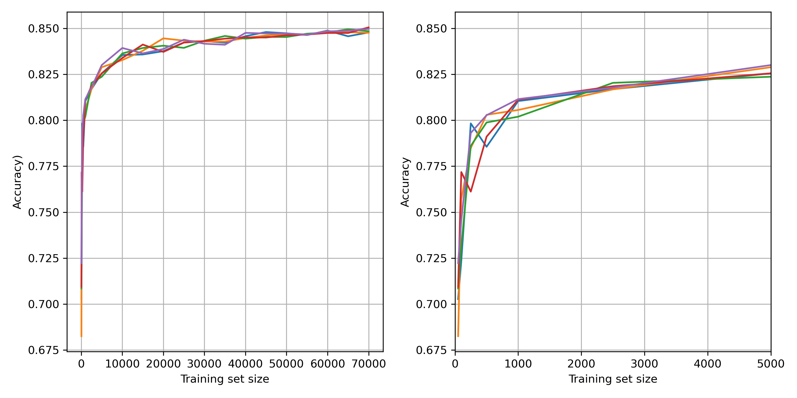

*Learning curves showing the relationship between training set size and model accuracy. Left: training set size up to 70k. Right: training set size up to 5k (same results as the results on the left). Results are shown for all 5 k-fold replicates.*

### Fine-tuning of model regularisation

As hospital ID is encoded as one-hot, and there are 132 hospitals, it is possible that the effect of hospitals ID becomes 'regularised out', especially as for each one-hot encoded column about 99% of the feature values will be zero. *Learning rate* in XGBoost acts as a regularising method. The lower the learning rate the less weight new trees have, and so the model becomes more regularised (less likely to overfit).

As we are concerned with differences between hospitals, we did not want to over-regularise the model. To optimise *learning rate* we looked at the between-hospital variation of predicted thrombolysis use in a 10k cohort of patients (with the model predicting the use of thrombolysis in each hospital with the same 10k cohort). The model was trained on the remaining 78,928 patients, with varying learning rates.

Reducing the learning rate below 0.5 led to reduced between-hospital variation in the predicted use of thrombolysis, suggesting that the effect of hospital ID was being reduced by over-regularisation. 

A learning rate of 0.5 was chosen for all modelling (including the accuracy measurements above).

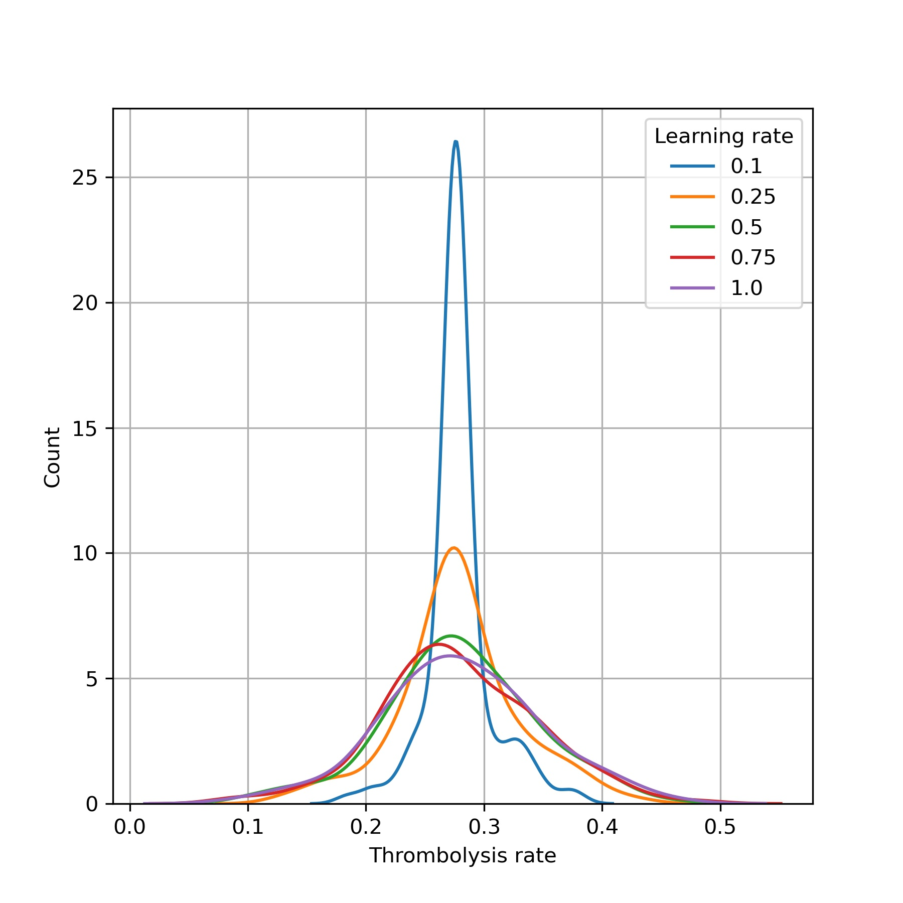

*Effect of adjusting XGBoost learning rate on the distribution predicted thrombolysis use across 132 hospitals. A narrower distribution indicates that hospital thrombolysis rates are tending towards the mean thrombolysis hospital rate.*

Statistics on the variation in predicted thrombolysis use between hospitals, with varying learning rate, is shown below:

| Learning rate  | 0.1  | 0.25 | 0.5  | 0.75 | 1.0  |
|----------------|------|------|------|------|------|
| Mean           | 0.28 | 0.28 | 0.28 | 0.28 | 0.28 |
| StdDev         | 0.03 | 0.05 | 0.06 | 0.07 | 0.07 |
| Min            | 0.18 | 0.13 | 0.10 | 0.09 | 0.09 |
| Max            | 0.38 | 0.43 | 0.45 | 0.48 | 0.46 |

## An analysis of the characteristics of the most thrombolysable patient at each hospital

We identified the patient with the highest probability of thrombolysis (taken from 5-fold combined test set results) at each hospital, and compared the feature values of those patients to:

* All patients
* All patients who had received thrombolysis
* All patients who had not received thrombolysis

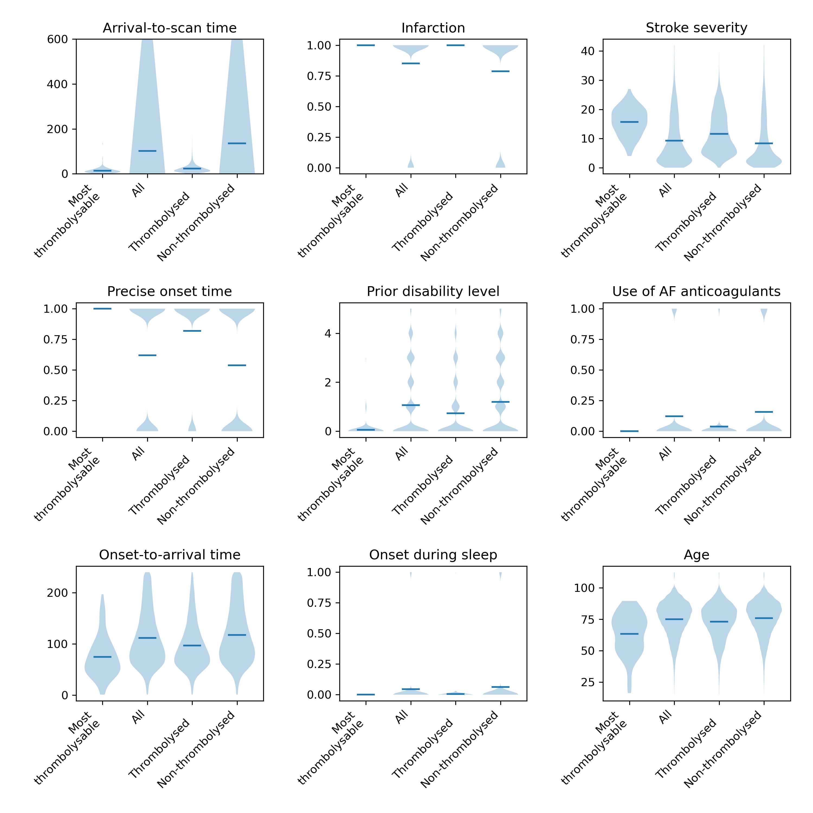

*Violin plots comparing feature values between the patient with the highest probability of thrombolysis at each hospital with all patients, all patients who had received thrombolysis, and all patients who had not received thrombolysis. Horizontal lines show the mean value of each group.*

Compared with the other groups, the most thrombolysable patients ....

* Had shorter arrrival-to-scan times
* Had an infarction stroke type
* Had stroke servities with NIHR 5-25
* Had a precise onset time
* Had lower pre-stroke disability
* Were not taking anticoagulant medication
* Had shorter onset-to-arrival times
* Did not have onset during sleep
* Were younger

## Explaining model predictions with SHAP

SHAP values describe how much a feature affects the probability of receiving thrombolysis. These are usually expressed as log odds; that is how much that feature adjusted the predicted log odds of receiving thrombolysis. Below is a brief introduction to probability, odds, log odds and SHAP values. 

### Probability, odds, and Shap values (log odds shifts): A brief explanation

Many of us find it easiest to think of the chance of something occurring as a probability. For example, there might be a probability of 10% that it will rain today. That is the same as saying there will be one rainy day out of ten days for days with this given probability of rain. However, rather than saying 1 in 10 days will be rainy, we can say that there is one rainy day for every nine days where it does not rain. The *odds* of rain take the ratio of rainy days to non-rainy days, and so the *odds* of a rainy day are 1/9 (or 0.111, as a decimal). 

In our stroke thrombolysis model, SHAP values tell us how knowing something particular about a patient (such as the patient *feature*, 'Is their stroke caused by a clot or a bleed?') adjusts our prediction of whether they will receive thrombolysis or not.

This is made a little more complicated for us because SHAP is usually reported as a *log odds shift*. It is useful for us to see how those relate to probabilities, and get a sense of how significant SHAP values in the range of -5 to +5 are, as that is a common range of SHAP values that we will see in our models.

#### Probability

We will take the example that SHAP reports that a model's base probability prediction, before the contribution of features is 0.25, or a 25% probability of receiving thrombolysis; that is 1 in 4 patients with this prediction would be expected to receive thrombolysis.

#### Odds

*Probability* expresses the chance of something happening as the number of positive occurrences as a fraction of all occurrences (i.e. the number of patients receiving thrombolysis as a fraction of the total number of patients).

*Odds* express the chance of something happening as the ratio of the number of positive occurrences (i.e. receiving thrombolysis) to the number of negative occurrences (i.e. *not* receiving thrombolysis).

If we have probability prediction of 0.25 of receiving thrombolysis, that would mean 1 in 4 of those patients would be expected to receive thrombolysis. Expressed as odds, for every one patient that receives thrombolysis, three will not. The odds are expressed as 1:3 or 1/3. This may also be calculated as a decimal (1 divided by 3), 0.333.

Odds (O) and probability (P) may be converted with the following equations:

1.  O = P / (1 - P)

2.  P = O / (1 + O)

#### SHAP values: Log odds shifts

Here we will calculate the effect of SHAP values, and try and build some intuition on the size of effect SHAP values of 0.5 to 5 give (we will look at positive and negative SHAP values).

SHAP usually outputs the effect of a particular feature in how much it shifts the odds. The SHAP value is usually given in 'log odds' (the logarithm of the odds value).We use the natural log (*ln*).

Let's look at some SHAP values (log odds) and see how much they change the odds of receiving thrombolysis.

First we'll look at the shift in odds the SHAP values give. This is calculated as *shift = exp(SHAP)*

|  SHAP (log odds) | Shift in odds (multiply original odds) |
|------------------|----------------------------------------|
|   0.5            |  1.65                                  |
|   1              |  2.72                                  |
|   2              |  7.39                                  |
|   3              |  20.1                                  |
|   4              |  54.6                                  |
|   5              |  148                                   |

*Positive SHAP values: a worked example*

Now let us work through an example of starting with a known baseline *probability* (before we consider what we know about a particular patient feature), converting that to *odds*, applying a Shap *log odds shift* for that particular feature, and converting back to *probability* after we have applied the influence of that feature.

Here are the effects of those shifts on our baseline probability of 0.25.

| Starting P | Starting O | SHAP | Shift (multiply O) | Shifted O | Shifted P (%)  |
|------------|------------|------|--------------------|-----------|----------------|
| 0.25 (25%) | 0.333      | 0.5  | 1.65               | 0.55      | 0.3547 (35.5%) |
| 0.25 (25%) | 0.333      | 1    | 2.72               | 0.907     | 0.4754 (47.5%) |
| 0.25 (25%) | 0.333      | 2    | 7.39               | 2.46      | 0.7112 (71.1%) |
| 0.25 (25%) | 0.333      | 3    | 20.1               | 6.7       | 0.87 (87.0%)   |
| 0.25 (25%) | 0.333      | 4    | 54.6               | 18.2      | 0.9479 (94.8%) |
| 0.25 (25%) | 0.333      | 5    | 148                | 49.5      | 0.9802 (98.0%) |

So, for example, a SHAP value of 0.5 for one particular feature tells us that that particular feature in that patient shifts our expected probability of that patient receiving thrombolysis from 25% to 36%. A SHAP value of 5 for the same feature would shift the probability of that patient receiving thrombolysis up to 98%.

*Negative SHAP values: a worked example*

If we have a negative SHAP value then odds are reduced (a SHAP of -1 will lead to the odds being divided by 2.72, which is the same as multiplying by 1/2.72, which is 0.3679):

| Starting P | Starting O | SHAP | Shift (multiply O) | Shifted O | Shifted P (%)  |
|------------|------------|------|--------------------|-----------|----------------|
| 0.25 (25%) | 0.333      | -0.5 | 1.65               | 0.55      | 0.1682 (16.8%) |
| 0.25 (25%) | 0.333      | -1   | 2.72               | 0.907     | 0.1092 (10.9%) |
| 0.25 (25%) | 0.333      | -2   | 7.39               | 2.46      | 0.0432 (4.32%) |
| 0.25 (25%) | 0.333      | -3   | 20.1               | 6.7       | 0.0163 (1.63%) |
| 0.25 (25%) | 0.333      | -4   | 54.6               | 18.2      | 0.0061 (0.61%) |
| 0.25 (25%) | 0.333      | -5   | 148                | 49.5      | 0.0022 (0.22%) |

So, for example, a SHAP value of -0.5 for one particular feature tells us that that particular feature in that patient shifts our expected probability of that patient receiving thrombolysis from 25% to 17%. A SHAP value of -5 for the same feature would shift the probability of that patient receiving thrombolysis down to 2%.

#### Observations about SHAP values

We begin to get some intuition on SHAP values. A SHAP value of +0.5 (or -0.5) leads to a small, but still noticeable, change in probability. SHAP values of +5 or -5 have effectively pushed probabilities to one extreme or the other.

### Consistency of SHAP values across 5-fold validation

We examined how reproducible SHAP values are between different k-fold models. The figure below shows the variation in mean absolute SHAP values obtained from the training sets of the 5 models in k-fold validation. SHAP values are well maintained across the five models.

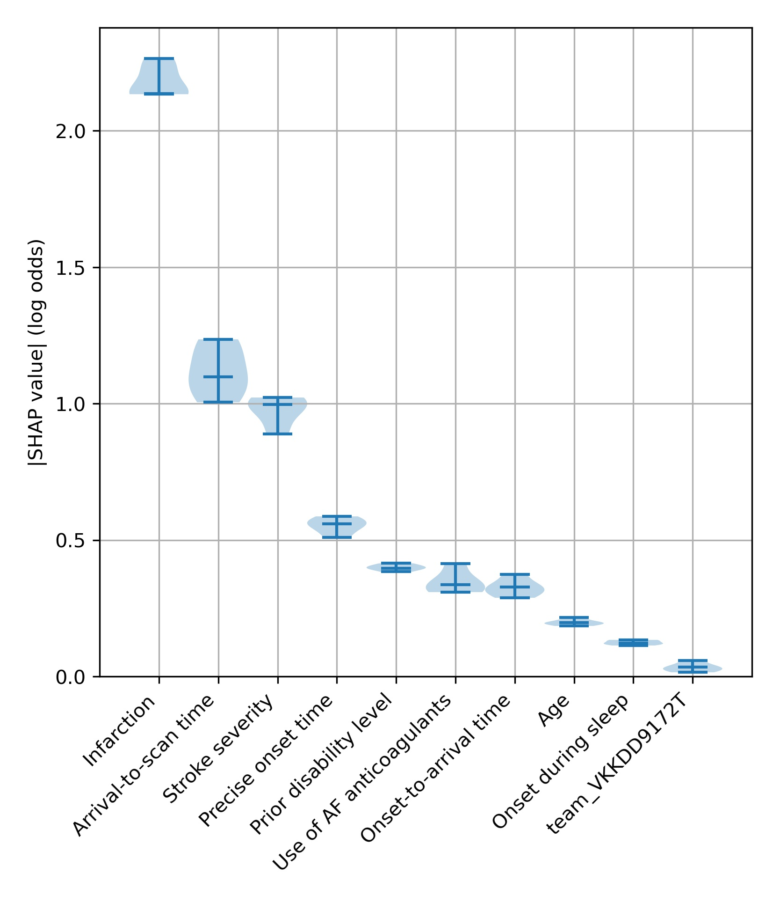

*Violin plots show the distribution of SHAP values across 5 k-fold models. The horizontal bar shows the median absolute SHAP value.*

This result gave us confidence to use a single train/split to further investigate what SHAP reveals about the model.

We also saw the order of general influence of features across the population (note: teams were separated out into individual one-hot features, and needed a separate analysis to examine SHAP of only those patients attending a particular hospital, as otherwise the SHAP was dominated by all the '0' one-hot encoded feature values):

1. Infarction
2. Arrival-to-scan time
3. Stroke severity
4. Precise onset time
5. Prior disability level
6. Use of AF anticoagulants
7. Onset-to-arrival time
8. Age
9. Onset during sleep

### Beeswarm plot of SHAP values

The *beeswarm* plot gives a high level view of the feature values and SHAP values across the whole data set. We saw, for example that if a patient had an infarction then SHAP values were in the range 1-2, but if the patient did not have an infarction (i.e. has a haemorrhage) then SHAP values were in the range -8 to -4, effectively preventing the model from ever predicting thrombolysis would be given to a haemorrhagic patient. The beeswarm plot was taken from training set for the first k-fold train/test split.

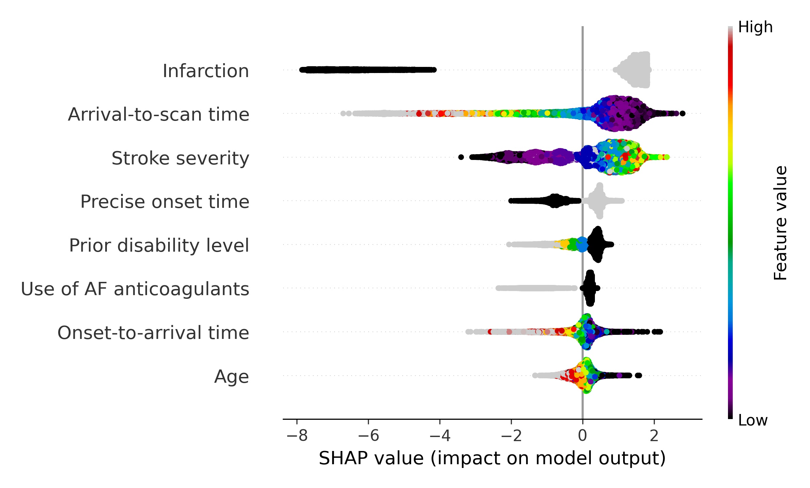

*Beeswarm plot of SHAP values, taken from the training set for the first of 5 k-fold train/test splits. Features values are indicated by color of the points, and the corresponding SHAP value is shown on the x-axis.*

### Violin plots of SHAP values

Violin plots show the relationship between feature values and SHAP values for individual patients (the bar in each violin shows the median value). The SHAP values were taken the SHAP values of the training set for the first of 5 k-fold train/test splits.

Note: SHAP values are not necessarily the same for all instances with the same feature value. This is because the SHAP value also depends on interactions between features. For example if a hospital is not pre-disposed to give thrombolysis to patients with mild stroke, the SHAP value for the NIHSS value (e.g. NIHSS=1 for  avery mild stroke) will be lower than the SHAP value for the NIHSS value for a similar patient attending a hospital with a greater predisposition to use thrombolysis in patients with milder strokes. These interactions will be explored later.

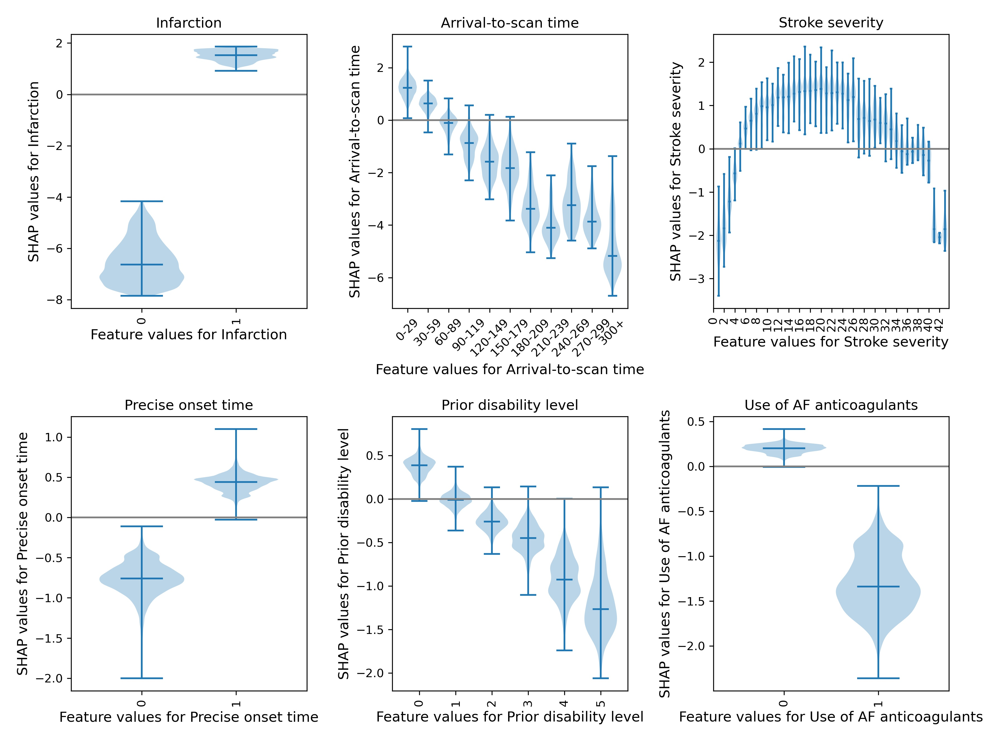

*Violin plots showing the relationship between SHAP values and feature values. The horizontal line shows the median SHAP value. SHAP values were taken from the training set of the first of 5 k-fold train/test splits.*

Key observations were, with SHAP values converted back to odds were:

* Stroke type: As expected,  the SHAP values for stroke types effectively eliminated any chance of receiving thrombolysis for non-ischaemic (haemorrhagic) stroke.

* Arrival-to-scan time: The odds of receiving thrombolysis reduced by about 20 fold over the first 100 minutes of arrival to scan time.

* Stroke severity (NIHSS): The odds of receiving thrombolysis was lowest at NIHSS 0, rose and peakws at NIHSS 15-25, and then fell again with higher stroke severity. The difference between minimum odds (at NIHSS 0) and maximum odds (at 15-25) of receiving thrombolysis was 30-35 fold.

* Stroke onset time type (precise vs. estimated): The odds of receiving thrombolysis were about 3 fold greater for precise onset time than estimated onset time.

* Disability level (Rankin) before stroke. The odds of receiving thrombolysis fell about 5 fold between mRS 0 and 5.

### Hospital SHAP values

When examining SHAP, we took the hospital SHAP values for patients attending each hospital (if we examined the hospital SHAP for all patients, it would be dominated by those not-attending each hospital (i.e. coded zero in the one-hot encoding). When we examined the hospital SHAP values for a model trained on all the data, and only for patients attending each hospital, the hospital SHAP values ranged from -1.4 to +1.4. This range of SHAP (log odds) represents a 15 fold difference in odds of receiving thrombolysis (most are in the range of -1 to +1, but this still represents a 7-8 fold difference in odds of receiving thrombolysis). 

*Distribution of hospital SHAP values for patients attending each hospital. SHAP values were taken from the training set of the first of 5 k-fold train/test splits.*

We compared the hospital SHAP value with the observed thrombolysis use at each hospital. For this experiment we combined the SHAP values from all the 5 k-fold test data splits, so that all instances were represented.

Hospital SHAP correlated with observed thrombolysis rate with an r-squared of 0.582 (P<0.0001) , suggesting that 58% of the between-hospital variance in thrombolysis use may be explained by the hospitals' SHAP values, that is the hospitals' predisposition to use thrombolysis.

*Correlation between median hospital SHAP value and the observed thrombolysis use at each hospital.*

The hospital SHAP value is composed of a *main* effect of the hospital, independent of other patient features, and *interaction effects*, which is how the hospital ID interacts with other patient features (e.g. if a hospital treats a certain type of patient in a way that is different to the usual pattern). We found that the SHAP value (which is the sum of the *main effect* and the *interaction effects*) for hospitals had a broader range than the main effect, as this value included how a hospital may have different predispositions to use thrombolysis in different types of patient. 

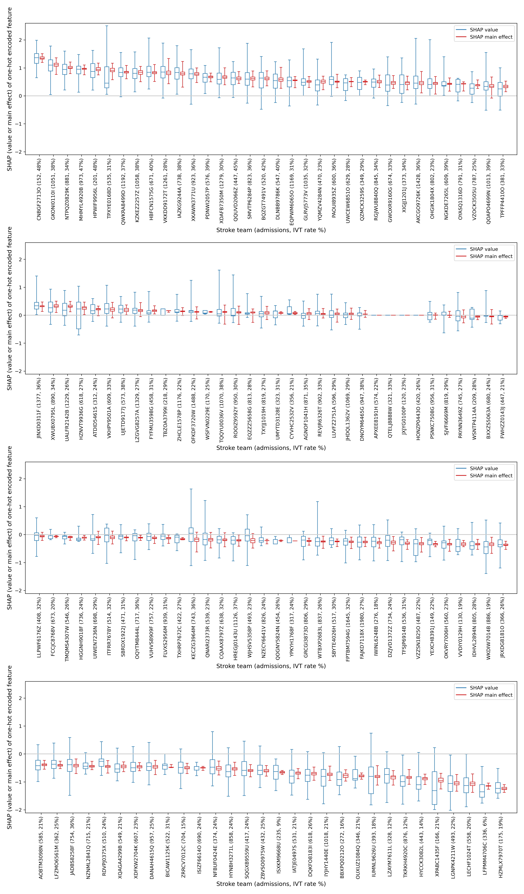

*Boxplots for the SHAP value (composed of the sum of the main effect and the interaction effects) and the SHAP main effect value, for each of 132 hospitals.*

When we re-examine the correlation between hospital SHAP and observed thrombolysis rate, we find that the main hospital SHAP effect accounts for 56% of the variance in thrombolysis rate (*c.f.* 58% for the full SHAP).

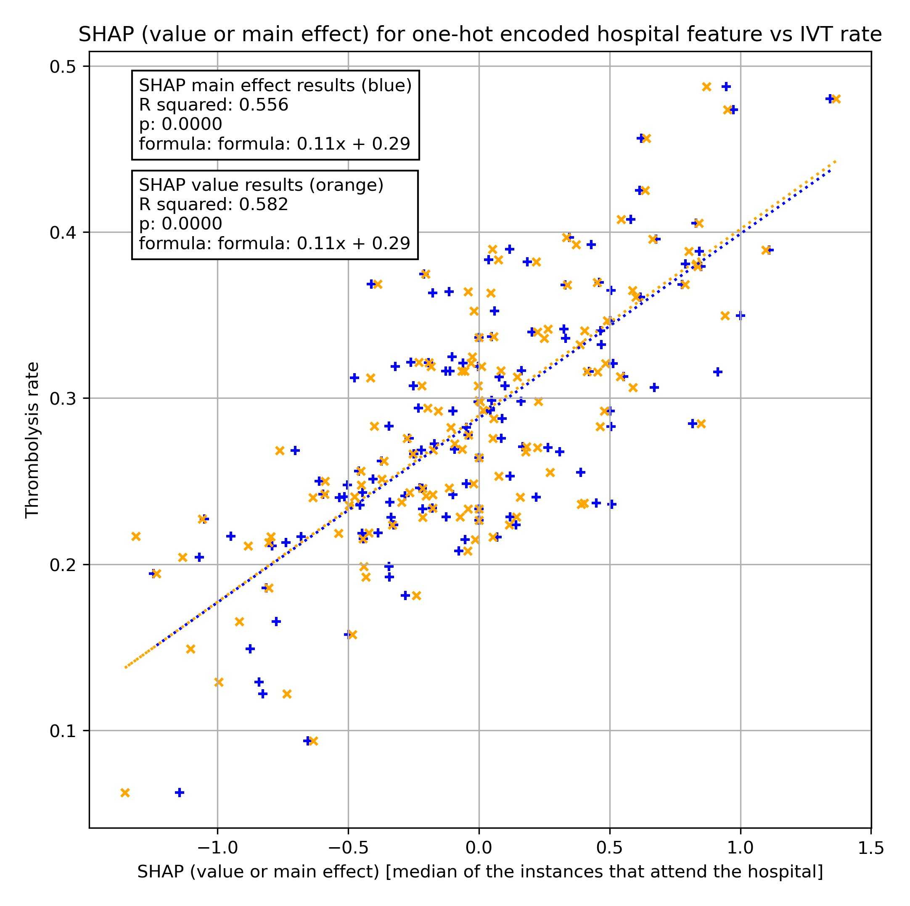

*Correlations between median hospital SHAP value or the median SHAP main effect value, and the observed thrombolysis use at each hospital.*

#### Hospital SHAP and 10k cohort 

When using the 10k cohort, changing the one-hot encoding to mimic all patients attending each of the 132 hospitals, we found that the median hospital SHAP value for the 10k patients correlated very closely with the predicted thrombolysis use in the 10k cohort at each hospital (r-squared = 0.947 for full SHAP and r-squared = 0.944 for the main effect), confirming that the hospital SHAP is providing a key insight into a hopsital's predisposition to use thrombolysis.

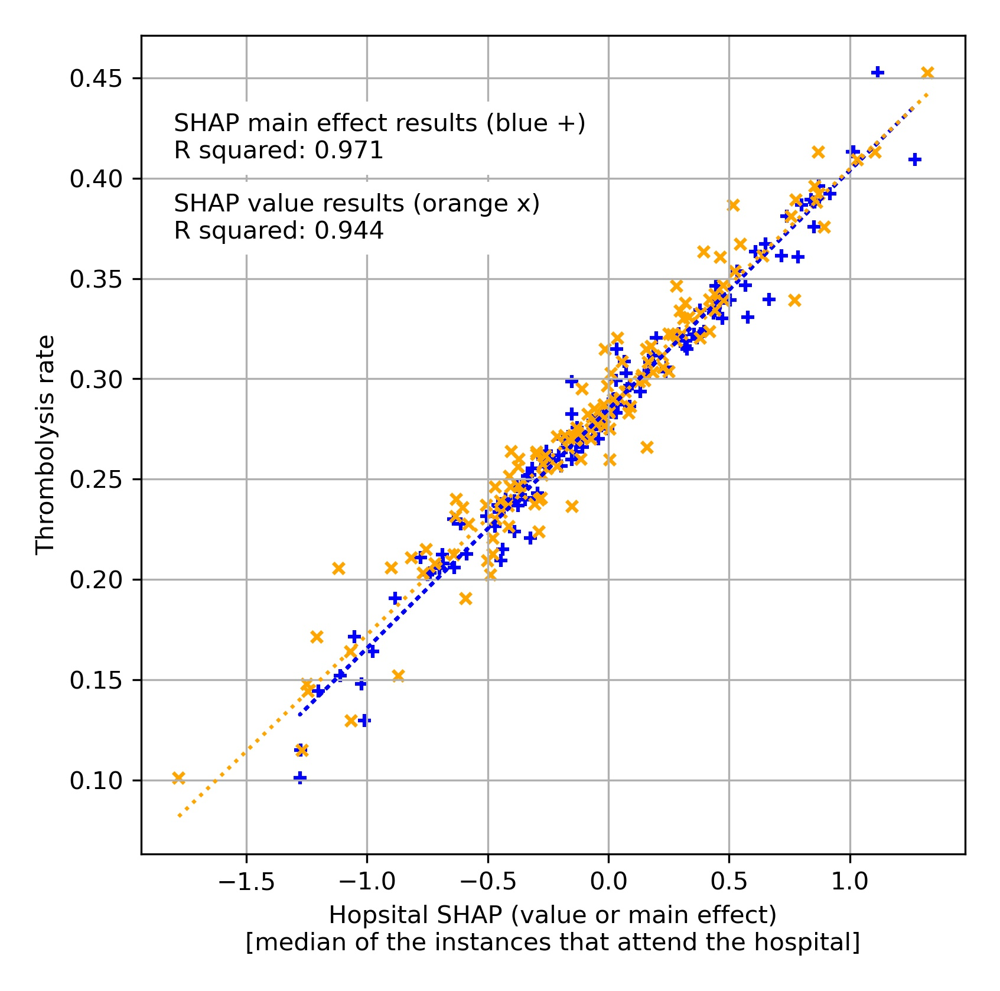

Though we model the same 10k patients going to all hospitals, we found that the SHAP interaction effect (the difference between the full SAHP value and the SHAP main effect) differed between hospitals. This demonstrated how the hospital SHAP is partly dependent on the patients attending (and the hospital's predisposition to give thrombolysis to different groups of patients).

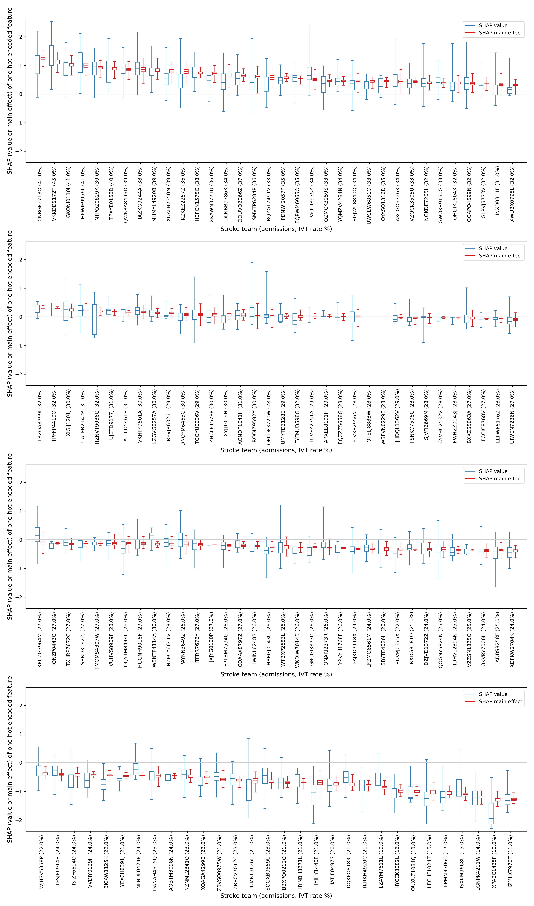

### Waterfall plots for individual patient predictions

Waterfall plots show the influence of features for an individual prediction. We generally handle SHAP values as how they affect log odds of receiving thrombolysis, but for individual predictions, probability plots are more intuitive for many people to follow. The example shown below is for a patient with a low probability of receiving thrombolysis. The model started with a base prediction of a 24% probability of receiving thrombolysis, before feature values are taken into account. Some features (coloured red) increased that base probability of receiving thrombolysis; those were onet-to-arrival time, having a precise onset time, having no prior disability, and being young. Three features (shown in blue) reduced the probability of receiving thrombolysis: the hospital they attended, the long arrival-to-scan time, and having a mild stroke, with a resulting final probability of receiving thrombolysis of 3%. 

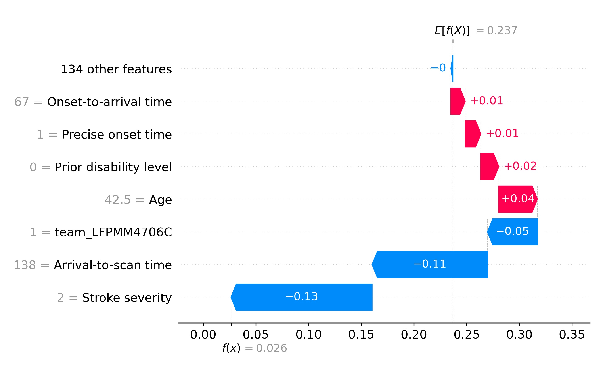

*Waterfall plot showing the influence of each feature on the predicted probability of a single patient receiving thrombolysis. This example is for a patient with a predicted low probability of receiving thrombolysis.*

We may see a similar plot for a patient with a high (96%) probability of receiving thrombolysis.

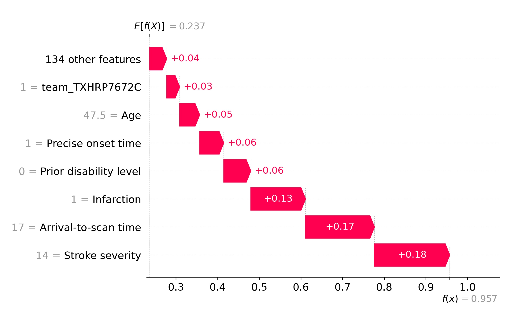

*Waterfall plot showing the influence of each feature on the predicted probability of a single patient receiving thrombolysis. This example is for a patient with a predicted high probability of receiving thrombolysis.*

## Hospital SHAP interactions

Below are three examples of how a particular hospital modified the general SHAP effects - either strengthening the effect, of attenuating it.

### Hospital and onset time interaction

The main effect of the *precise onset time* is that if onset time is known precisely then SHAP (log odds) is increased by 0.42, otherwise it is reduced by 0.85.

*Team_HZNVT9936G* has a slightly higher main effect for hopsital SHAP (0.26) than *Team_FAJKD7118X -0.27)*. *Team_HZNVT9936G* also has interactions that strengthen the effect of *precise onset time* whereas *Team_FAJKD7118X* has interactions values that attenuate the main effect of *precise onset time*. 

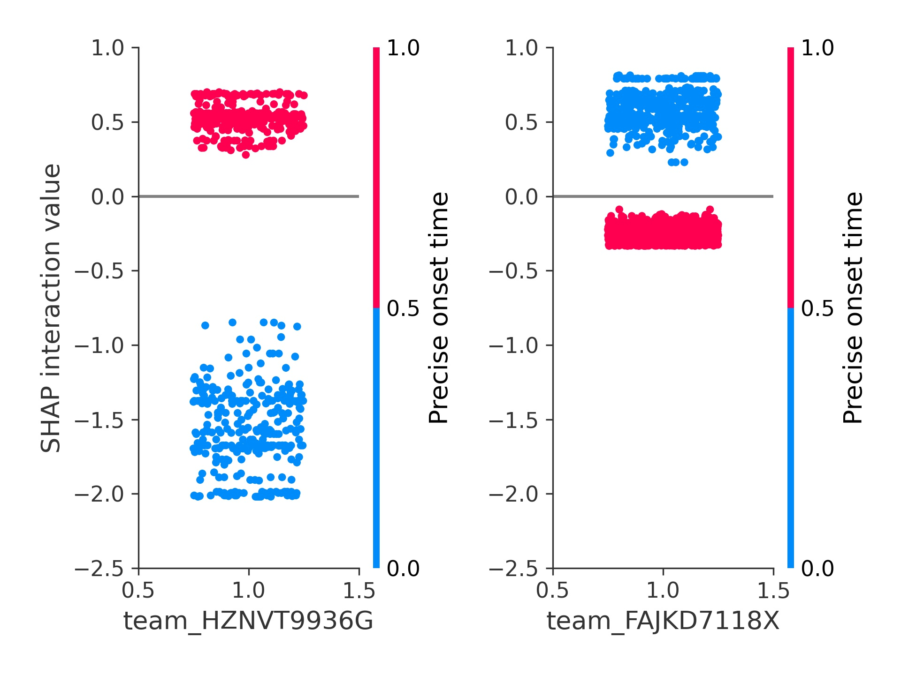

*SHAP interaction between hospital ID for two teams and whether stroke onset time was known precisely. If a patient attended team HZNVT9936G then SHAP value for having a precise onset time was increased (a strengthening of the main effect of precise onset time). If a patient attended team FAJKD7118X then SHAP value for having a precise onset time was reduced (an attenuation of the main effect of precise onset time).*

### Hospital and stroke severity interaction

The main effect of stroke severity is to significantly reduce the odds of receiving thrombolysis for mild strokes (NIHSS 0-5), increase the odds of receiving thrombolysis for more moderate to sever strokes (NIHSS 6-32), and then reduce the odds of receiving thrombolysis for very severe stroke strokes (NIHSS 33+).

*Team_TPXYE0168D* has a higher general tendency to use thrombolysis than *Team_SMVTP6284P* (team main effect SHAP = 0.92 vs 0.62)

*Team_TPXYE0168D* has a SHAP interaction that opposes the general stroke severity main effect, especially increasing the odds of receiving thrombolysis for mild strokes. *Team_SMVTP6284P* strengthens the main effect of stroke severity - reducing the odds of receiving thrombolysis even further for mild strokes.

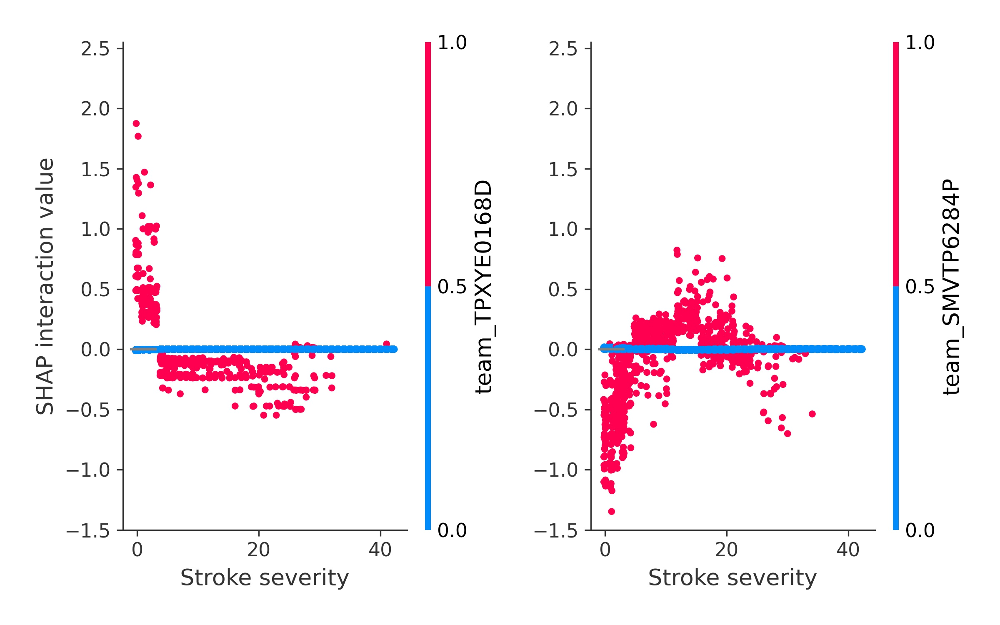

*SHAP interaction between hospital ID for two teams and stroke severity. If a patient attended team TPXYE0168D then SHAP values for low stroke severity were increased (an attenuation of the main effect of stroke severity). If a patient attended team SMVTP6284P then SHAP values for low and severe stroke severity were reduced (a strengthening of the main effect of stroke severity).*

### Hospital and stroke severity interaction

The main effect of prior disability is to progressively reduce the odds of receiving thrombolysis with increasing disability (a SHAP of +0.3 for mrS=0 down to -1.50 for mRS=5).

*Team_XKAWN3771U* has a slighty higher general tendency to use thrombolysis than *Team_AKCGO9726K* (team main effect SHAP = 0.78 vs 0.45). *Team_XKAWN3771U* has a SHAP interaction that opposes the general prior disability main effect. *Team_AKCGO9726K* strengthens the main effect of pre-stroke disability - reducing the odds of receiving thrombolysis even further for mild strokes.

*SHAP interaction between hospital ID for two teams and pre-exisiting disability. If a patient attended team AKCGO9726K then SHAP values for increasing pre-stroke disability were increased (an attenuation of the main effect of stroke severity). If a patient attended team XKAWN3771U then SHAP values for increasing pre-stroke disability were reduced (a strengthening of the main effect of stroke severity).*

## General SHAP interactions

All features may interact with each other, and SHAP captures all these 2-way interactions. We found that the feature main effects (without interactions) accounted for 62% of the total SHAP values, and 38% of the total SHAP values cam from interactions. The figure below shows interactions between all features, excluding the one-hot encoded hospitals.

*SHAP interactions between all features, excluding hospital attended. One feature is shown on the x-axis, and the other feature is colour-coded (from blue for low feature values, and red for high feature values). The y-axis shows the value of the SHAP interaction between the two features; that is the additional value added to the main SHAP effects of each feature.*

Some key interactions are:
  * If a stroke is haemorrhagic, then the interaction is such that the presence of haemorrhage cancels out much of the other SHAP effects (i.e. stroke severity does not matter if the stroke is haemorrhagic).
  * Likewise elsewhere we find that features that each give negative SHAP values alone have an interaction that attenuates the combined effect of the two features together a little.

## Subgroup analysis

We analyse the observed and predicted use of thrombolysis in subgroups of patients.Those groups are:

  * Mild stroke severity (NIHSS < 5)
  * No precise onset time
  * Existing pre-stroke disability (mRS > 2)
  * An *'ideal'* thrombolysable patient:
    * Stroke severity NIHSS in range 10-25
    * Arrival-to-scan time < 30 minutes
    * Stroke type = infarction
    * Precise onset time = True
    * Prior diability level (mRS) = 0
    * No use of AF anticoagulants
    * Onset-to-arrival time < 90 minutes
    * Age < 80 years
    * Onset during sleep = False
    
For the observed thrombolysis use, data was limited to the patients attending each hospital. For the predicted thrombolysis use the predictions were based on the 10k patient cohort for all hospitals.

The figure below shows a boxplot of either observed and predicted use of thrombolysis.

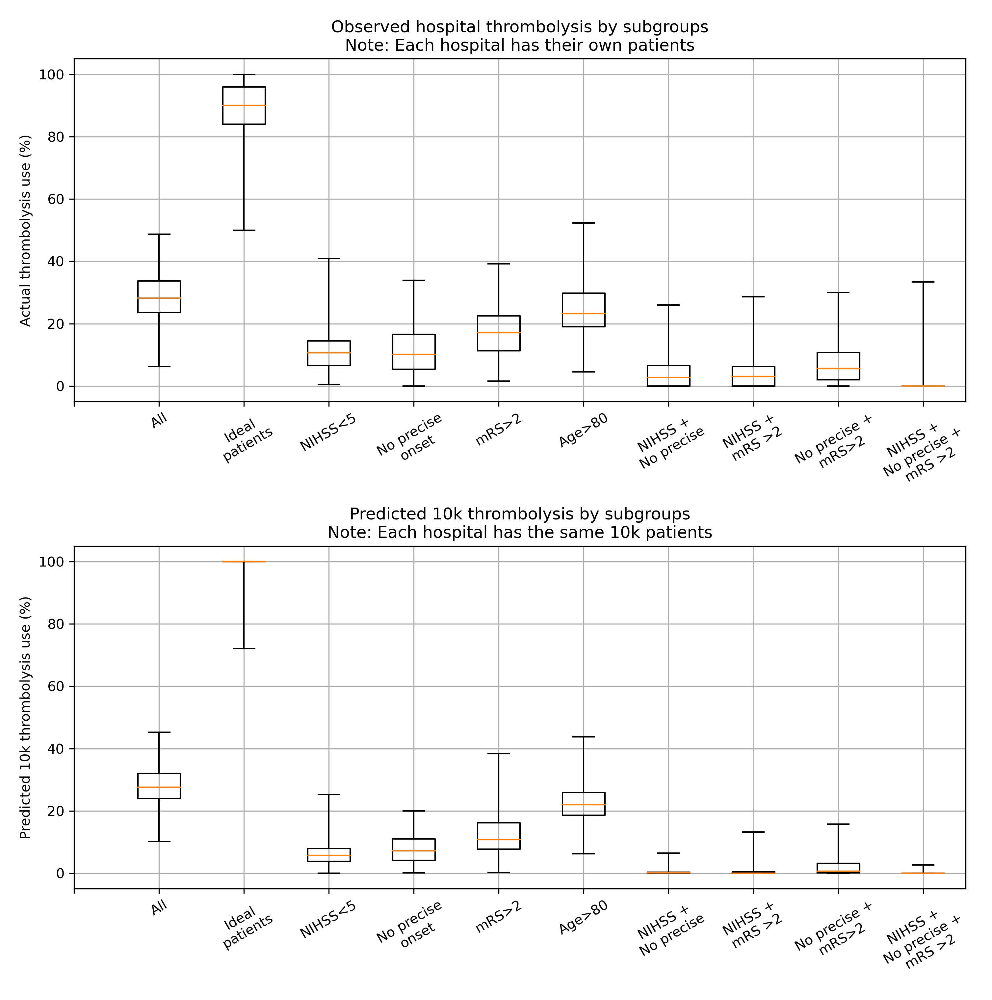

*Boxplot for either observed (top) or predicted (bottom) use of thrombolysis for subgroups of patients.*

The observed and predicted subgroup analysis show very similar general patterns (and with a r-squared=0.95).

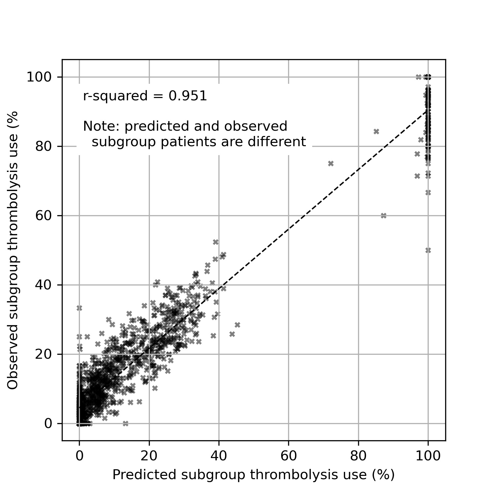

*A comparison of predicted and observed use of thrombolysis at each hospital for all subgroups*

The three subgroups of NIHSS <5, no precise stroke onset time, and prestroke mRS > 2, all had reduced thrombolysis use, and combining these non-ideal features reduced thrombolysis use further.

Some differences exist:
* The use of thrombolysi in *ideal* patients is a little low in the observed vs actual results (mean hospital thrombolysis use = 89% vs 99%).
* The predicted results show a stronger effect of combining non-ideal features.
* The observed thrombolysis rate shows higher between-hospital variation than the predicted thrombolysis rate. This may be partly explained by the observed thrombolysis rate being on different patients at each hospital, but may also be partly explained by actual use of thrombolysis being slightly more variable than predicted thrombolysis use (which will follow general hospital patterns, and will not include, for example, between-clinician variation at each hospital).

When we look at thrombolysis use in subgroups at each hospital we see that the observed thrombolysis use tended to reduce in parallel, along with total thrombolysis use, suggesting a shared caution in use of thrombolysis in 'less ideal' patients. 

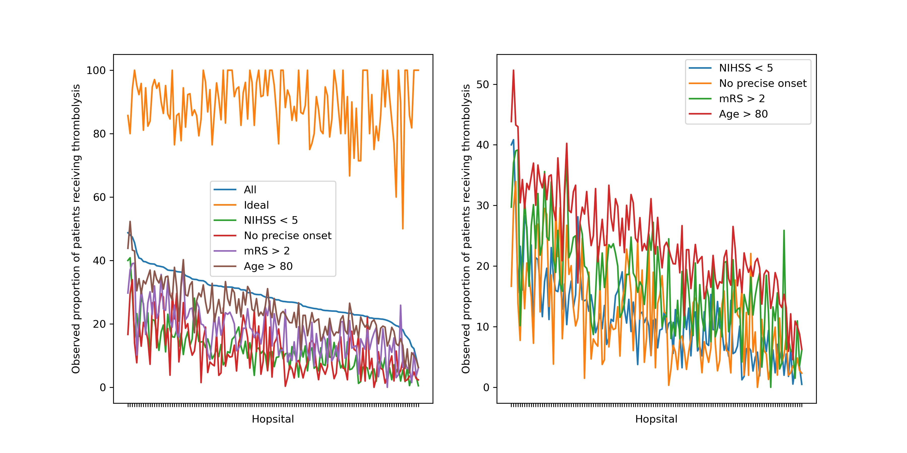

*Observed thrombolysis use for all patients and subgroups of patients at each of 132 hospitals, with hospitals ordered by descending thrombolysis use of all patients. Results are for all patients attending each hospital.*

This parallel reduction in use of thrombolysis across the subgroups was also seen in the predicted use of thrombolysis.

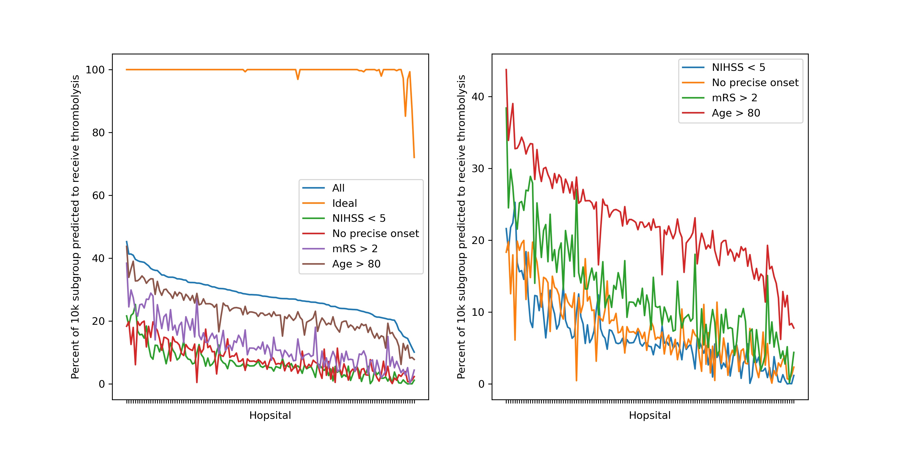

*Predicted thrombolysis use for all patients and subgroups of patients at each of 132 hospitals, with hospitals ordered by descending thrombolysis use of all patients. Results are based on a prediction of thrombolysis in a 10k cohort of patients.*

## A comparison of thrombolysis use in high and low thrombolysing units by feature values

This experiment plots the relationships between feature values and thrombolysis use for low and high thrombolysing hospitals. The high and low thrombolysing hopsitals are taken as the top and bottom 30 hospitals as ranked by the predicted thrombolysis use in the same 10k cohort of patients. We find that thrombolysis use in low thrombolysing hospitals follows the same general relationship with feature values as the high thrombolysing hospitals, but thrombolysis is consistently lower.

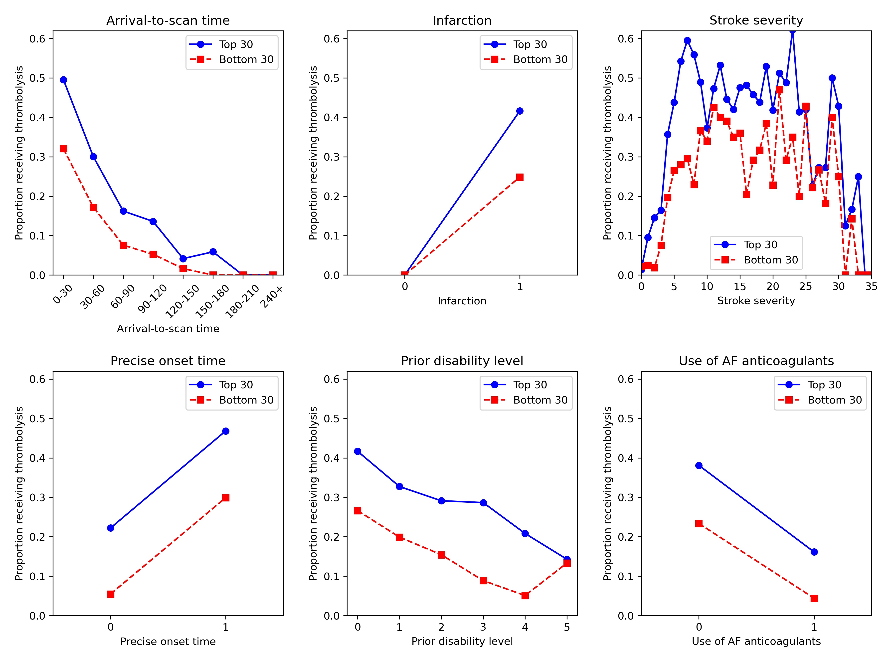

*Observed use of thrombolysis by feature value in the top (blue) and bottom (red) 30 thrombolysing hospitals as assessed by predicted thrombolysis use in a 10k cohort of patients.*

## Artificial patients

We use artificial patients to investigate controlled changes to patients, and see how many hospitals are predicted to give thrombolysis.

We start with a 'base patient' who has features that are favourable to use of thrombolysis:

* Onset to arrival = 80 mins
* Arrival to scan = 20 mins
* Infarction = 1 
* NIHSS = 15
* Prior disability level = 0
* Precise onset time = 1
* Use of AF anticoagulents = 0

We then vared the following features in turn, keeping all other features the same as the base patient:

* NIHSS = 0-40
* Prior disability level = 0-5
* Precise onset time = 0-1

The number of hospitals giving predicted to give thrombolysis to these alternative artificial patients was:

* Base patient: 132 (99%)
* As base patient, but NIHSS = 5: 123 (93%)
* As base patient, but pre-stroke disability = 2: 125 (95%)
* As base patient, but estimated stroke onset time: 109 (83%)

Combining two marginal features:

* As base patient, but NIHSS = 5 and pre-stroke disability = 2: 78 (59%)
* As base patient, but NIHSS = 5 and estimated stroke onset time: 30 (23%)
* As base patient, but pre-stroke disability = 2 and estimated stroke onset time: 26 (20%)

Combining three marginal features:

* As base patient, but NIHSS = 5, pre-stroke disability = 2, estimated stroke onset time: 2 (1.5%)

Starting with the ideal patient, and changing only feature at a time we investigated changing stroke severity, pre-stroke disability, and precise onset time.

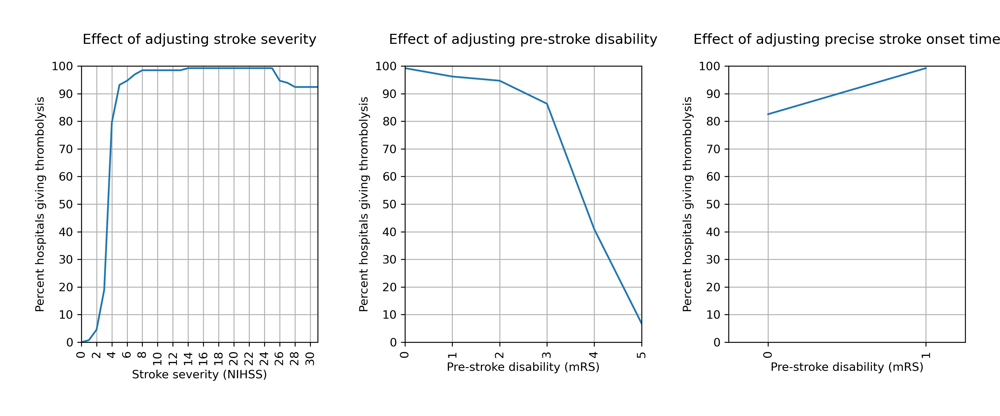

*The effect of changing stroke severity, pre-stroke disability, or precise onset time on the proportion of hospitals that would be expected to give thrombolysis to a patient. Patients otherwise have the following feature values: Onset to arrival = 80 mins, Arrival to scan = 20 mins, Infarction = 1, NIHSS = 15, Prior disability level = 0, Precise onset time = 1, Use of AF anticoagulents = 0.*

We also studied combining changes to the patient (starting with the 'ideal' thrombolysable patient. The chart below shows the proportion of hospitals predicted to give a patient thrombolysis by altering stroke severity in combination with estimated (non-precise) onset time, mild pre-existing disability (mRS 2), or a combination of estimated onset time and mild pre-existing disability.

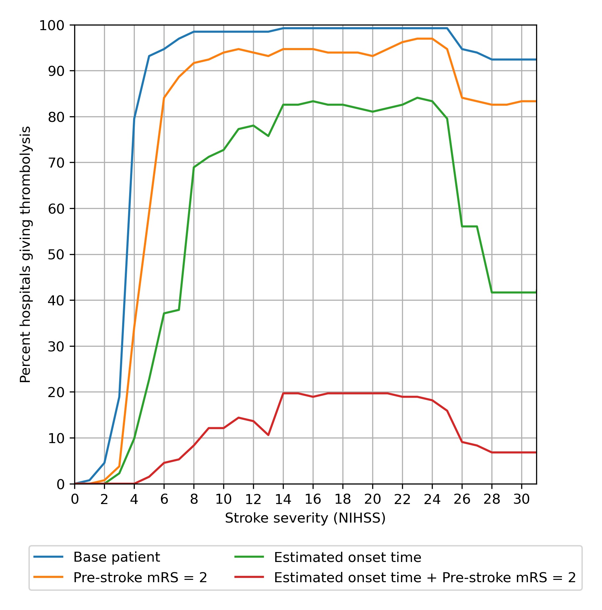

*The effect of changing stroke severity, alone (blue), or coupled with changes to pre-stroke disability (to mRS = 2, orange), precise onset time (to False, green), or changes to both pre-stroke disability and precise onset time (red) on the proportion of hospitals that would be expected to give thrombolysis to a patient. Patients otherwise have the following feature values: Onset to arrival = 80 mins, Arrival to scan = 20 mins, Infarction = 1, NIHSS = 15, Prior disability level = 0, Precise onset time = 1, Use of AF anticoagulents = 0.*

## 10k cohort and *'benchmark'* decisions

In this experiment we predict, for each hospital, the expected use of thrombolysis for a 10k cohort of patients (the model is trained on the remaining 78,792 patients.

The 30 hospitals with the highest predicted thrombolysis use in the 10k cohort were considered *benchmark* hospitals.

We then took each hospitals own patients and predicted the thrombolysis decision that would made for each patient at each of the hospitals, taking a majority vote of those benchmark hospitals as the *benchmark decision* for that patient. We estimated the use of thrombolysis at each hospital if the benchmark decision was followed for all patients attending each hospital.

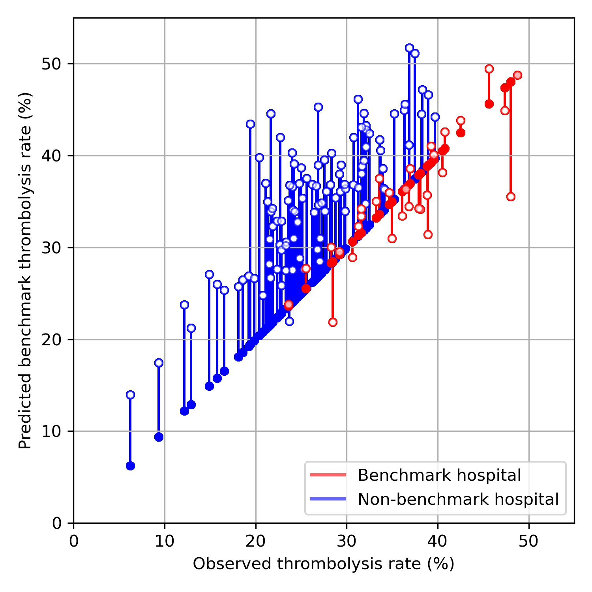

*A comparison of observed (actual) thrombolysis rate at each hospital and the predicted thrombolysis rate if decisions were made according to the majority vote of the 30 benchmark hospitals. The solid circle shows the current thrombolysis use, and the open circle shows the thrombolysis use predicted by a majority vote of the benchmark hospitals. The red points are those hospitals that are in the top 30 thrombolysing hospitals (the benchmark set) when 10k cohort thrombolysis use is predicted, with all other hospitals coloured blue.*

* 83.3% decisions are identical between local and benchmark decisions.
* Thrombolysis use would be increased 31.2% at non-benchmark hospitals if benchmark decisions were made at those hospitals. Overall, thrombolysis use, including at the benchmark hospitals, would be increased 20.7%. Thrombolysis at the 30 lowest thrombolysing units (judged by expected 10k thrombolysus rate) would be increased 60.2%.
* The ratio of benchmark:local thrombolysis use ranged from 0.7 to 2.1.

### Agreement between hopsitals on 10k cohort thrombolysis decisions

87.4% of patients have 80% of hospitals agree on treatment. For those patients that did actually receive thrombolysis, 78.8% of patients have 80% of hospitals agree to thrombolyse. For those patients that did not actually receive thrombolysis, 91.1% of patients have 80% of hospitals agree not to thrombolyse. 

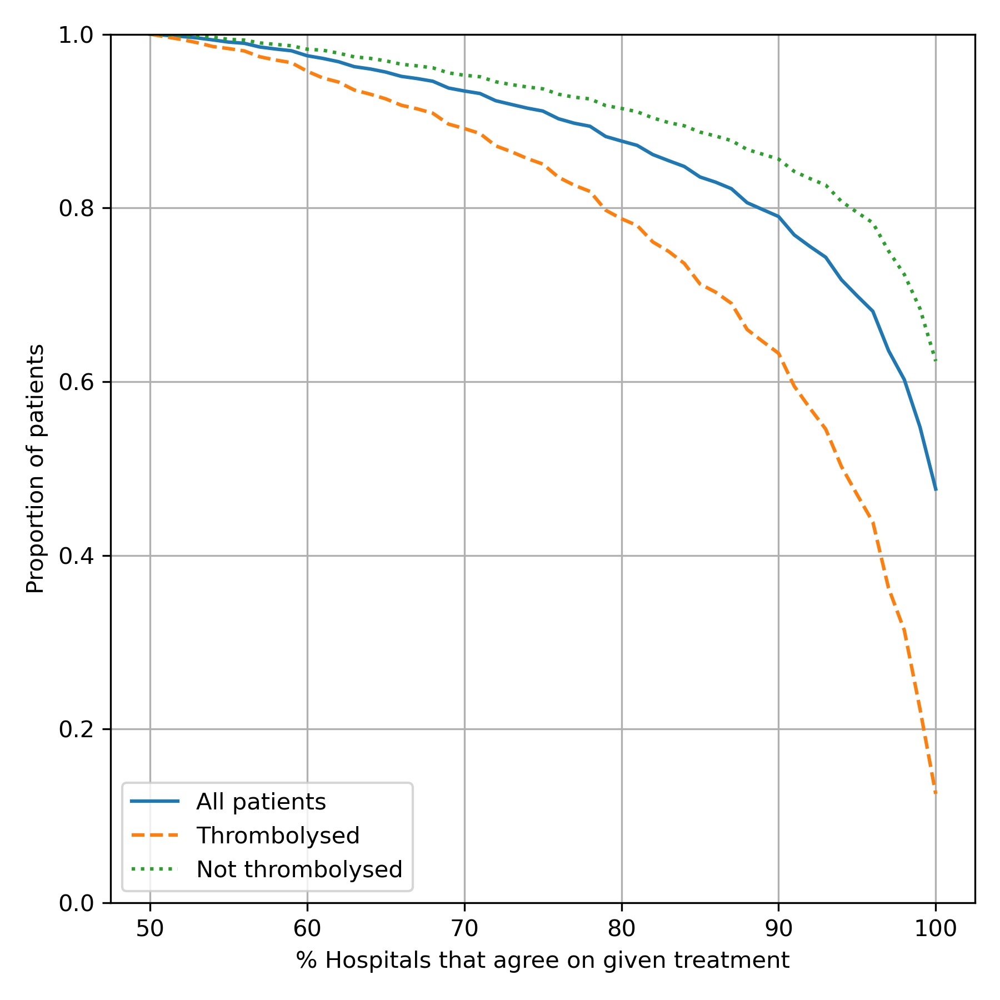

*Agreement on decision-making between hospitals when predicting thrombolysis use in the 10k patient cohort. The x-axis shows the proportion of hospitals which must agree on a decision, and the y-axis shows the proportion of patients that have that level of agreement. Analysis is for all decisions (blue solid), for those who did receive thrombolysis (orange dashed), or for those that did not receive thrombolysis (green dotted).*
